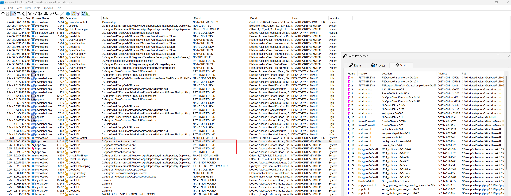
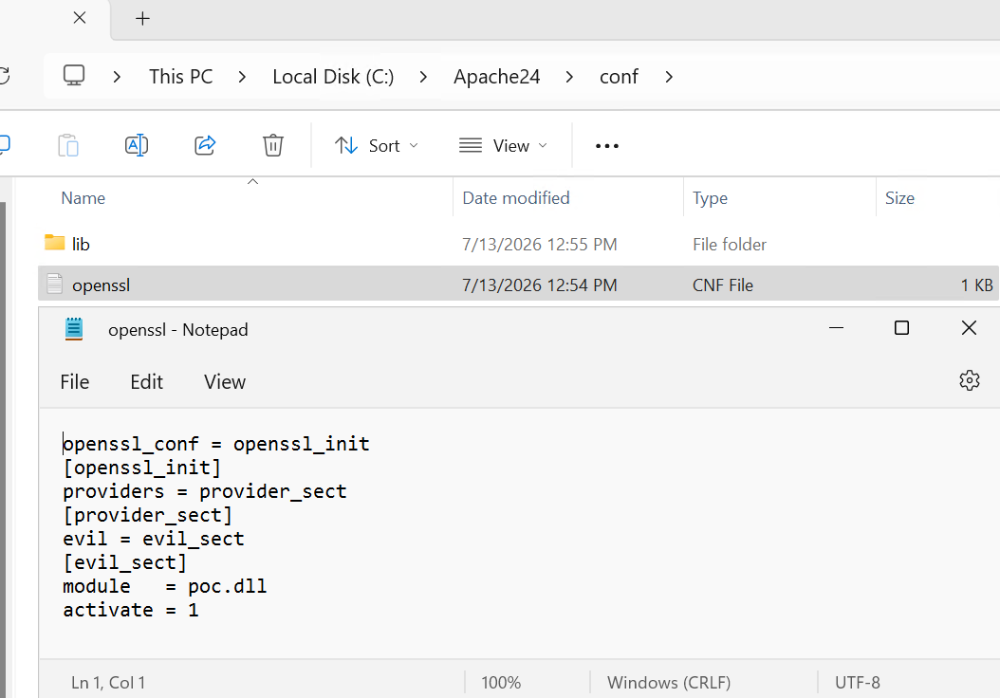
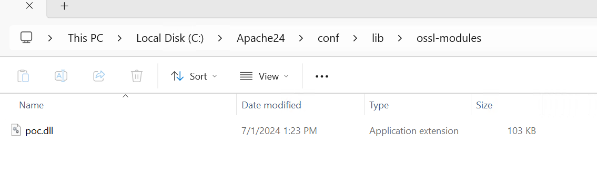
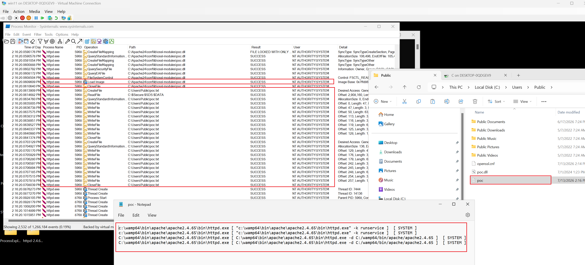
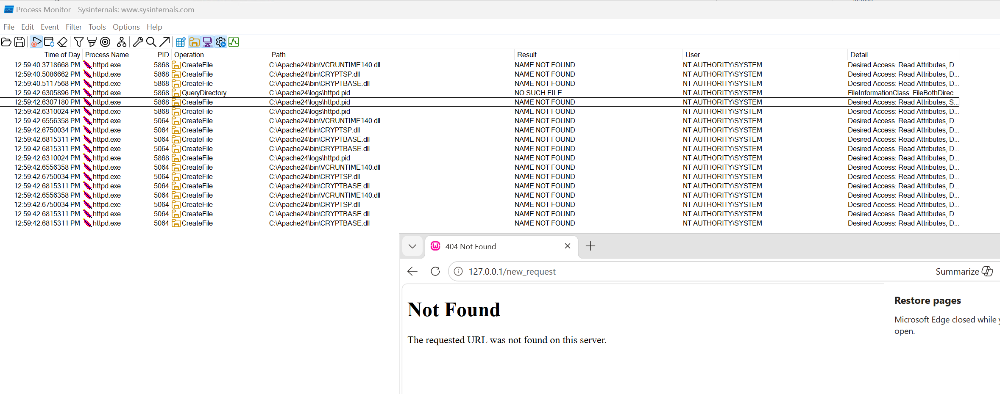
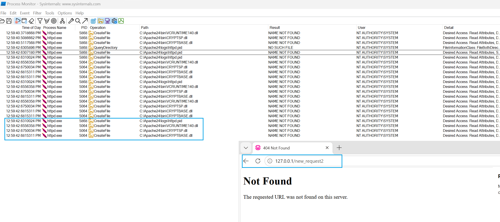
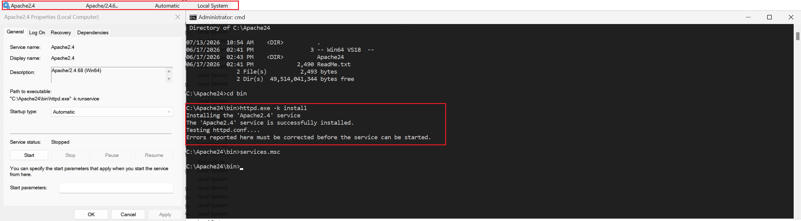

# Apache Lounge distribution of Apache HTTP Server (Windows) Local Privilege Escalation (CVE-2026-89281, CVE-2026-89282)

## Summary

Any member of the Authenticated Users group can inject arbitrary code into the Apache HTTP Server process (Local Privilege Escalation to NT AUTHORITY/SYSTEM).

All Windows deployments are affected by default, with two separate root causes:

 - CVE-2026-89282: weak permissions on the installation directory (trivial and easy to fix),
 
 - CVE-2026-89281: hardcoded C:\Apache24 path in libcrypto-3-x64.dll, embedded during build and used to resolve configuration files whose directives allow arbitrary code execution via forged SSL providers and PEAR extensions). By default C:\php does not exist, so it can be planted by any Authenticated User. The same goes for C:\Apache24 when the deployment path is different than C:\Apache24, because just like with C:\php the structure can be planted by any Authenticated User. 

These Windows builds are used in various software products.

## Vector 1
This vector applies to all deployments where the installation path is NOT `C:\Apache24`.

It boils down to planting a malicious `C:\Apache24\conf\openssl.cnf` file, which upon start makes the server load an arbitrary DLL file defined in that config. This directory and file structure can be created by any member of the Authenticated Users group (this is and always has been the Windows OS default). 

**Root cause**

Windows builts, particularly libcrypto-3-x64.dll, use hardcoded path `C:\Apache24` to search for the openssl.cnf config file, regardless of where the server is actually deployed. This is demonstrated in the screenshot below with Process Monitor:



I believe this fixed location must have been passed as an argument during compilation (strings analysis of libcrypto-3-x64.dll suggests that), so the bug comes to existence through the combination of a fixed build flag and the OS default, in addition to how the server is implemented. I presume the fixed path `C:\Apache24` comes from the assumption that the server will always be deployed in that exact path.

**Proof of Concept**

Exploitation is trivial. Just create the relevant file and directory structure, as demonstrated in the screenshots below and in the poc/ directory provided with this report:





When the server starts/restarts, the DLL of the fake crypto provider defined in the malicious openssl.cnf gets loaded and executed in the httpd.exe server process. The DLL used for this test only grabs the current process information and the user running it (to confirm where it got injected and with what privileges) and appends it into C:\Users\Public\poc.txt file. Source code provided in poc/poc.cpp + poc/dll.h:



## Vector 2

If the server is actually deployed in `C:\Apache24`, `C:\Apache24\conf\openssl.cnf` already exists, but just like any other file in that directory by default **can be modified** by Authenticated Users, because by default the `C:\Apache24` location inherits its DACL from its parent (the C:\ volume). This is the OS default and the exact installation scenario described in the oficial README.txt of the Apache Lounge project.

One caveat - if the deployment folder is first created through extraction in a location with a strong DACL (e.g. user home directory), and then moved - like with cmd.exe "move" command, it does not inherit those default insecure permissions from C: and thus the deployment is secure. Any other method leaves the folder vulnerable.

Here's a breakdown:

```
------------------------------------------------------------------------------
COPY METHOD                                            |     STATUS      |
------------------------------------------------------------------------------
Copy & paste with explorer                             |   VULNERABLE    |
------------------------------------------------------------------------------
robocopy C:\Users\win11\Desktop\foo4 C:\foo4           |   VULNERABLE    |
------------------------------------------------------------------------------
Direct creation with mkdir C:\foo                      |   VULNERABLE    |
------------------------------------------------------------------------------
Direct creation with explorer                          |   VULNERABLE    |
------------------------------------------------------------------------------
Move with explorer (drag & drop)                       |   VULNERABLE    |
------------------------------------------------------------------------------
Move with explorer (cut & paste)                       |   VULNERABLE    |
------------------------------------------------------------------------------
Move via command line with                             |                 |
move C:\Users\win11\Desktop\foo4 C:\                   |                 |
or                                                     | NOT VULNERABLE  |
move C:\Users\win11\Desktop\foo4 C:\foo4               |                 |
------------------------------------------------------------------------------
Extraction to C:\foo with builtin ZIP folders          |   VULNERABLE    |
------------------------------------------------------------------------------
Extraction to C:\foo with 7z                           |   VULNERABLE    |
------------------------------------------------------------------------------
```

## Tested on

The tests were conducted on latest Apache Lounge builds (https://www.apachelounge.com/download/VS18/binaries/httpd-2.4.68-260617-Win64-VS18.zip) and an instance of WAMP server (version 4.0 64 bit). While WAMP which is generally not meant for production use, and while deployment directory permissions are easy to fix, the hardcoded path vectors are independent and universal to all Windows builds that are currently distributed.

The attempt to load openssl.cnf from the hardcoded `C:\Apache24\conf\openssl.cnf` path was traced to libcrypto-3-x64.dll. WAMP uses binaries provided by the Apache Lounge project (https://www.apachelounge.com/). Then additional tests on the Apache Lounge deployment package (ZIP) have been performed, confirming initial suspicions.

Two versions of libcrypto-3-x64.dll were tested and they both reveal the same pattern (presence of `C:\Apache24` hardcoded strings):
- version 3.5.1.0 (SHA256 BD93306192CA12AF8713C9D9AE1DBBC3FEDB07F49C66B6B686E1838FDB974DF2),
- version 3.6.3.0 (SHA256 AEC6DDD5A683188E183DCD2C0E673959B8BB067D9920F4A618A67C83EDA63135).


## Affected products

Apache Lounge, WAMP, XAMPP, and multiple closed products that build on top of Apache Lounge binaries.

## CVSS scores

For vector 1 a service start/restart is required, which can be best reflected in the CVSS score as "User Interaction: Required". This slightly lowers the score (from the standard LPE 7.8 to 7.3), but what is an offensive disadvantage can also be seen as something useful - being able to deploy a malicious file with delayed execution is technically a form of persistence, allowing offensive operation to continue even if the initial access vector is lost/inactive.

For vector 2, it turns it is possible to trigger several DLL loading attempts in the deployment directory by simply sending a GET request, just like demonstrated in the screenshot below (therefore no restart is required):

After sending 2 requests:



After sending 3-rd request:



Also, the service process starts as NT AUTHORITY/SYSTEM (as demonstrated earlier int he proof of concept). This was also confirmed by inspecting the relevant service entry after deployment with `httpd.exe -k install`:



### Vector 1

**CVSS**: `AV:L/AC:L/PR:L/UI:R/S:U/C:H/I:H/A:H` (Base Score: 7.3 (High))

### Vector 2

**CVSS**: `AV:L/AC:L/PR:L/UI:N/S:U/C:H/I:H/A:H` (Base Score: 7.8 (High))


## Recommendation

Vector 3 should be addressed by securing the permissions on the deployment directory, like below:
```cmd
icacls C:\<target_dir> /inheritance:d
icacls C:\<target_dir> /remove:g "Authenticated Users" /T /C
```

A well-known SID can be used to avoid localization/name issues:

```cmd
icacls C:\<target_dir> /remove:g *S-1-5-11 /T /C
```

An installer (MSI or even just a script) would be a more elegant way to address the default permissions Authenticated Users have on directories created directly on C:. In such case potential hijackings of nonexistent files in the installation directory are no longer a security concern. Currently Apache Lounge provides no installer, just a ZIP package, and the setup instruction in Readme.txt does not mention anything about the permissions of the extracted folder.

To address vectors 1 and 2 the harcoded path from compilation/linking must be removed. 

The end goal is to have the server only use paths within its installation directory and have that directory secured.


# Timeline 

16.07.2026 - Issue reported to ASF

17.07.2026 - Issue reported to info@apachelounge.com

21.07.2026 - Thread https://www.apachelounge.com/viewtopic.php?t=9515 created

28.08.2026 - CVEs assigned by US CERT

22.09.2026 - Article https://atos.net/wp-content/uploads/2026/09/Cybershield-hijacks-article.pdf published