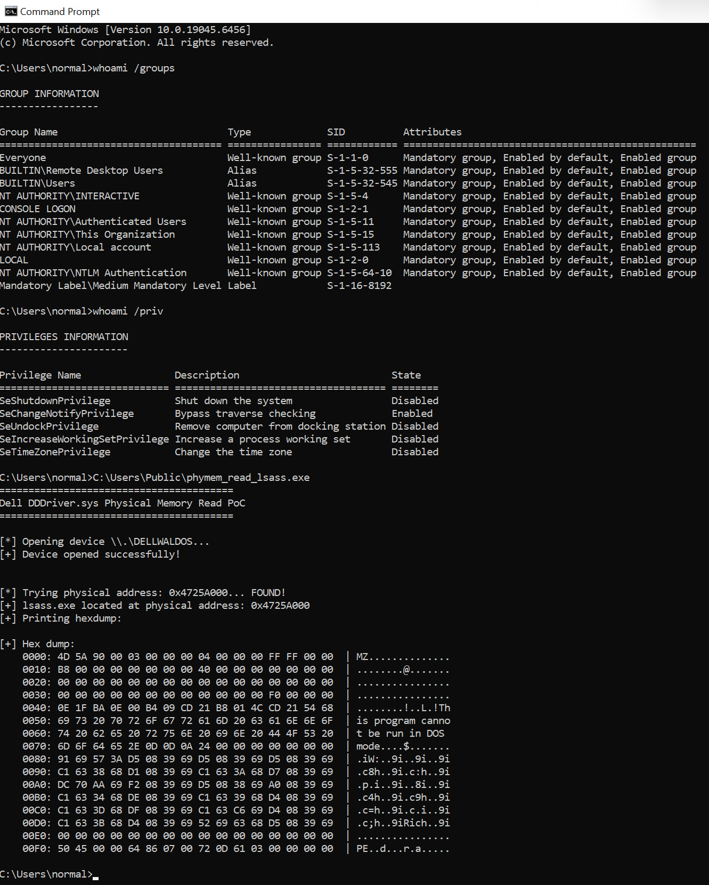

**Issue**: Arbitrary Physical Memory Read / Information Disclosure

**Product**: Dell Diags Device Driver  (DDDriver)

**Version tested**: 1.4.2.0

**SHA1**: df4f7b9b7bd3d7bff9a998f730bdde4797778613

**Details**:

The driver is vulnerable to arbitrary physical memory reading.

When installed manually using standard `sc.exe create`, the device object SDDL allows any user to open a handle to its control device \\.\DELLWALDOS, as per its security descriptor:

`O:BAG:SYD:(A;;0x1201bf;;;WD)(A;;FA;;;SY)(A;;FA;;;BA)(A;;0x1200a9;;;RC)S:AI(ML;;NW;;;LW)`

with a permissive ACE for the builtin Everyone group: A;;0x1201bf;;;WD.

After exchanging communication with the vendor we were made aware that during normal installation the device object receives an admin-only SDDL, ruling out standard privilege escalation impact (limiting this behavior to BYOVD-style scenarios).

IOCTL handler for IOCTL 0x9c40241c allows reading arbitrary memory (arbitrary address, arbitrary size) by simply providing a valid physical memory address and the size of requested read.

The driver also implements a feature translating virtual addresses to physical ones, under IOCTL 0x9c40244c, but that implementation is broken, truncating half of the required 8-byte address into a DWORD. For that reason this functionality was not chained with the final proof of concept.

Instead, for the purpose of demonstration, the current physical address of the image section of the lsass.exe process from the researcher's lab was hardcoded. This address could as well be provided dynamically after being obtained through other means (such as platform-conventional RAM, documented user-mode firmware tables, resource map, superfetch/NtQuerySystemInformation memory-range information, another vulnerability or a safe address validity testing primitive). 
The practical challenge with this vulnerability alone (with IOCTL 0x9c40244c (VA->PA) not working correctly), is the fact that since the driver does not provide any validation of the user-supplied address before passing it to MmMapIoSpace, providing an incorrect value immediately causes a system crash.

Below is a log from the steps taken to obtain the current physical address of an arbitrary process (image section of lsass.exe was chosen), using WinDBG in kernel mode:

```
0: kd> !process 0 0 lsass.exe
PROCESS ffffc00b971180c0
    SessionId: 0  Cid: 0330    Peb: 3d86ed000  ParentCid: 0270
    DirBase: c93ec000  ObjectTable: ffffd6043056ad00  HandleCount: 1089.
    Image: lsass.exe

DirBase: c93ec000

0: kd> .process /p ffffc00b971180c0
Implicit process is now ffffc00b`971180c0

!peb 3d86ed000
PEB at 00000003d86ed000
    InheritedAddressSpace:    No
    ReadImageFileExecOptions: No
    BeingDebugged:            No
    ImageBaseAddress:         00007ff76a2c0000
    NtGlobalFlag:             0
    NtGlobalFlag2:            0
    Ldr                       00007ffaac5fc4c0
    Ldr.Initialized:          Yes
    Ldr.InInitializationOrderModuleList: 00000140a8a03970 . 00000140a90893c0
    Ldr.InLoadOrderModuleList:           00000140a8a03ae0 . 00000140a90893a0
    Ldr.InMemoryOrderModuleList:         00000140a8a03af0 . 00000140a90893b0
                    Base TimeStamp                     Module
            7ff76a2c0000 03610d72 Oct 19 05:48:02 1971 C:\Windows\system32\lsass.exe
            7ffaac490000 7ec9c15d May 28 21:24:13 2037 C:\Windows\SYSTEM32\ntdll.dll
```

So, dirbase is c93ec000 and image section base address is 7ff76a2c0000. 

Now translate the virtual address to physical:

```
!vtop c93ec000 00007ff76a2c0000

0: kd> !vtop c93ec000 00007ff76a2c0000
Amd64VtoP: Virt 00007ff76a2c0000, pagedir 00000000c93ec000
Amd64VtoP: PML4E 00000000c93ec7f8
Amd64VtoP: PDPE 00000000c35f8ee8
Amd64VtoP: PDE 00000000c35f9a88
Amd64VtoP: PTE 00000000c32fa600
Amd64VtoP: Mapped phys 000000004725a000
Virtual address 7ff76a2c0000 translates to physical address 4725a000.
```

So, this is the (currently valid) address to hardcode into POC: 4725a000.

```
0: kd> db 00007ff76a2c0000 L100
00007ff7`6a2c0000  4d 5a 90 00 03 00 00 00-04 00 00 00 ff ff 00 00  MZ..............
00007ff7`6a2c0010  b8 00 00 00 00 00 00 00-40 00 00 00 00 00 00 00  ........@.......
00007ff7`6a2c0020  00 00 00 00 00 00 00 00-00 00 00 00 00 00 00 00  ................
00007ff7`6a2c0030  00 00 00 00 00 00 00 00-00 00 00 00 f0 00 00 00  ................
00007ff7`6a2c0040  0e 1f ba 0e 00 b4 09 cd-21 b8 01 4c cd 21 54 68  ........!..L.!Th
00007ff7`6a2c0050  69 73 20 70 72 6f 67 72-61 6d 20 63 61 6e 6e 6f  is program canno
00007ff7`6a2c0060  74 20 62 65 20 72 75 6e-20 69 6e 20 44 4f 53 20  t be run in DOS 
00007ff7`6a2c0070  6d 6f 64 65 2e 0d 0d 0a-24 00 00 00 00 00 00 00  mode....$.......
00007ff7`6a2c0080  91 69 57 3a d5 08 39 69-d5 08 39 69 d5 08 39 69  .iW:..9i..9i..9i
00007ff7`6a2c0090  c1 63 38 68 d1 08 39 69-c1 63 3a 68 d7 08 39 69  .c8h..9i.c:h..9i
00007ff7`6a2c00a0  dc 70 aa 69 f2 08 39 69-d5 08 38 69 a0 08 39 69  .p.i..9i..8i..9i
00007ff7`6a2c00b0  c1 63 34 68 de 08 39 69-c1 63 39 68 d4 08 39 69  .c4h..9i.c9h..9i
00007ff7`6a2c00c0  c1 63 3d 68 df 08 39 69-c1 63 c6 69 d4 08 39 69  .c=h..9i.c.i..9i
00007ff7`6a2c00d0  c1 63 3b 68 d4 08 39 69-52 69 63 68 d5 08 39 69  .c;h..9iRich..9i
00007ff7`6a2c00e0  00 00 00 00 00 00 00 00-00 00 00 00 00 00 00 00  ................
00007ff7`6a2c00f0  50 45 00 00 64 86 07 00-72 0d 61 03 00 00 00 00  PE..d...r.a.....
```

Running the poc after hardcoding the address into it:



This was only to demonstrate that this behavior allows reading any physical memory address accessible from VTL0, including memory belonging to protected processes, as long as they can provide the valid physical memory address. 


## Timeline

17.12.2025 - Reported to secure@dell.com

18.12.2025 - Dell confirmed that they have started triaging the submission

26.02.2026 - Dell came back saying the driver has been EOL for a while, therefore no action will be taken

06.02.2026 - Full disclosure