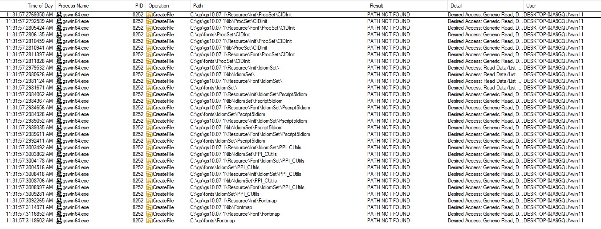
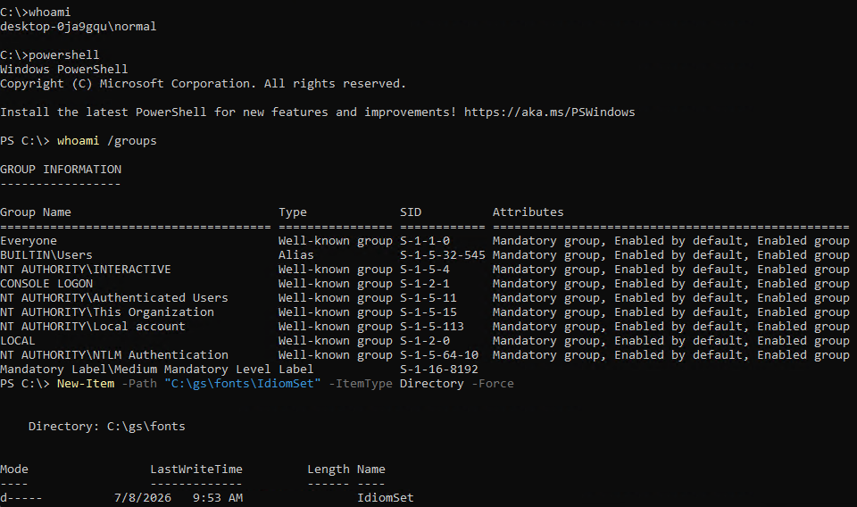
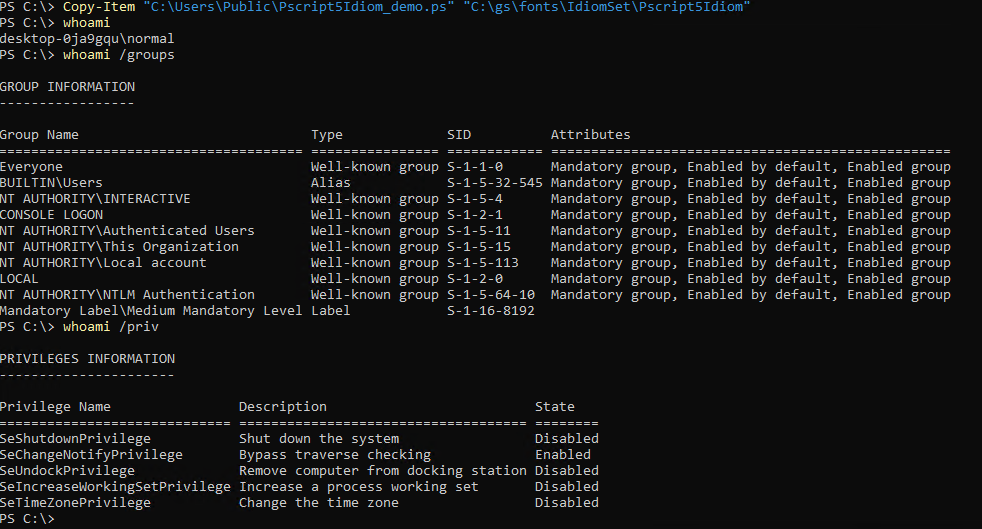
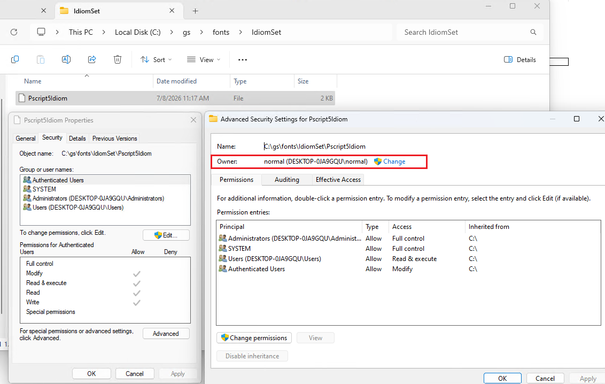
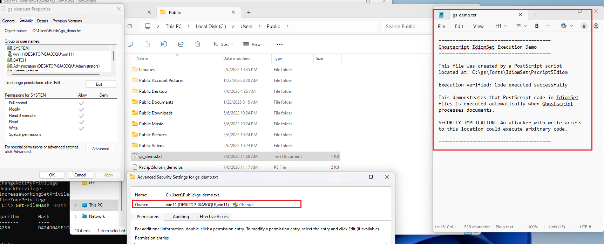

# Cross-User Code Execution via PostScript Resource Hijacking in Ghostscript for Windows (CVE-2026-19547)

## Summary

Ghostscript for Windows is vulnerable to local privilege escalation (LPE) through PostScript resource file hijacking. The vulnerability arises from:

1. Ghostscript searching for PostScript resource files (IdiomSet, ProcSet, Decoding) in predictable paths under `C:\gs\` that do not exist by default on Windows installations.
2. Windows default Access Control Lists (ACLs) allowing any authenticated user to create new directories at the root of `C:\`, including `C:\gs\` and its subdirectories.
3. PostScript resource files being executable code that runs automatically during Ghostscript initialization, before document processing begins.

An unprivileged local attacker can create the directory structure `C:\gs\fonts\IdiomSet\` and plant a malicious PostScript file named `Pscript5Idiom`, which will be executed with the privileges of any user or service that subsequently runs Ghostscript to process documents.

## Severity

- **CVSS 3.1 Base Score**: 7.3 (High)
- **Vector**: `CVSS:3.1/AV:L/AC:L/PR:L/UI:R/S:U/C:H/I:H/A:H`
- **Attack Complexity**: Low — requires only directory/file creation access at `C:\`, which is granted by default to authenticated users.
- **Privileges Required**: Low — any authenticated user (default ACL on `C:\` root-created directories).
- **User Interaction**: Required — a privileged user or automated process must run Ghostscript.

## CWE Classification

- **CWE-427**: Uncontrolled Search Path Element
- **CWE-73**: External Control of File Name or Path

## Affected Versions

- Tested on: Ghostscript for Windows; 10.05.1 commercial version and 10.07.1.0 AGPL version (C:\Program Files\gs\gs10.07.1\bin\gswin64.exe, SHA256          D424D0A9E1C8480E090093CAC8905CB63F8F9E3C96314F2D65B03CAD6237EDA5), downloaded on today (8th July 2026) from the official website
- Affected: All Ghostscript versions for Windows that search non-existent paths under `C:\gs\` for PostScript resources
- The vulnerability exists regardless of command-line arguments or document type being processed

## Technical Analysis

### Default Windows ACL Inheritance

On default Windows installations, directories created at the root of `C:\` inherit the following ACL from `C:\` itself:

- **BUILTIN\Administrators**: Full Control
- **NT AUTHORITY\SYSTEM**: Full Control
- **BUILTIN\Users**: Read & Execute, List, Read
- **NT AUTHORITY\Authenticated Users**: Create Files / Write Data, Create Folders / Append Data

This means **any authenticated user on the system can create `C:\gs\fonts\IdiomSet\` and write files into it**.

Example ACL on a newly created `C:\gs` directory:
```
C:\gs  BUILTIN\Administrators:(I)(OI)(CI)(F)
       NT AUTHORITY\SYSTEM:(I)(OI)(CI)(F)
       BUILTIN\Users:(I)(OI)(CI)(RX)
       NT AUTHORITY\Authenticated Users:(I)(M)
       NT AUTHORITY\Authenticated Users:(I)(OI)(CI)(IO)(M)
```

This default behavior is [well-documented in the security community](https://itm4n.github.io/windows-dll-hijacking-clarified/) and affects all known versions of Windows, including Windows 11 (verified June 2026).

### Ghostscript Resource Search Paths

During initialization, Ghostscript searches for PostScript resource files in multiple directories. Below is the full list of nonexistent references observed with Process Monitor:

 - C:\gs\fonts\Decoding\StandardEncoding
 - C:\gs\fonts\Decoding\Unicode
 - C:\gs\fonts\Fontmap
 - C:\gs\fonts\IdiomSet\
 - C:\gs\fonts\IdiomSet\PPI_CUtils
 - C:\gs\fonts\IdiomSet\Pscript5Idiom
 - C:\gs\fonts\ProcSet\CIDInit
 - C:\gs\gs10.05.1\Resource\Font\Decoding\StandardEncoding
 - C:\gs\gs10.05.1\Resource\Font\Decoding\Unicode
 - C:\gs\gs10.05.1\Resource\Font\Fontmap
 - C:\gs\gs10.05.1\Resource\Font\IdiomSet\
 - C:\gs\gs10.05.1\Resource\Font\IdiomSet\PPI_CUtils
 - C:\gs\gs10.05.1\Resource\Font\IdiomSet\Pscript5Idiom
 - C:\gs\gs10.05.1\Resource\Font\ProcSet\CIDInit
 - C:\gs\gs10.05.1\Resource\Init\Decoding\StandardEncoding
 - C:\gs\gs10.05.1\Resource\Init\Decoding\Unicode
 - C:\gs\gs10.05.1\Resource\Init\Fontmap
 - C:\gs\gs10.05.1\Resource\Init\IdiomSet\
 - C:\gs\gs10.05.1\Resource\Init\IdiomSet\PPI_CUtils
 - C:\gs\gs10.05.1\Resource\Init\IdiomSet\Pscript5Idiom
 - C:\gs\gs10.05.1\Resource\Init\ProcSet\CIDInit
 - C:\gs\gs10.05.1\lib\Decoding\StandardEncoding
 - C:\gs\gs10.05.1\lib\Decoding\Unicode
 - C:\gs\gs10.05.1\lib\Fontmap
 - C:\gs\gs10.05.1\lib\IdiomSet\
 - C:\gs\gs10.05.1\lib\IdiomSet\PPI_CUtils
 - C:\gs\gs10.05.1\lib\IdiomSet\Pscript5Idiom
 - C:\gs\gs10.05.1\lib\ProcSet\CIDInit



These paths are checked during every Ghostscript execution, regardless of whether the resources actually exist or are needed for the specific document being processed.

### PostScript Resource Files as Executable Code

PostScript resource files loaded by Ghostscript are **not passive data files** — they are executable PostScript programs. Three categories of resources are particularly relevant:

#### 1. IdiomSet Files (HIGH RISK)
- **Purpose**: Define pattern-matching rules for PostScript code optimization
- **Execution**: PostScript code at the top-level scope executes during file loading
- **Timing**: Runs during Ghostscript initialization, before any document processing
- **Privileges**: Executes with the full privileges of the Ghostscript process

#### 2. ProcSet Files (HIGH RISK)
- **Purpose**: Define reusable PostScript procedures (functions)
- **Execution**: Initialization code runs when the ProcSet is loaded
- **Usage**: Procedures become available for all subsequent operations

#### 3. Decoding Files (MEDIUM RISK)
- **Purpose**: Define character encoding mappings
- **Execution**: Can contain initialization PostScript code

All of these resource types allow arbitrary PostScript code execution, including:
- File I/O operations (especially `writestring`, as it provides arbitrary file write primitve, which can be turned into code execution)
- Potentially direct process execution (via `pipe` operator, if not restricted by `-dSAFER`)
- Potentially reading sensitive files

### Proof of Concept

A benign proof-of-concept (included in Pscript5Idiom_demo.ps) was developed that creates `C:\Users\Public\gs_demo.txt` when Ghostscript loads the IdiomSet file. Testing confirmed:

- File creation occurs automatically when Ghostscript runs  
- Execution happens before document processing begins  
- Code runs with the privileges of the Ghostscript process  
- No specific document content or arguments required  

One of the ways a real attack could be performed using the arbitrary file creation primitive is creation of an executable script, such as PowerShell profile (`C:\Users\<user>\Documents\WindowsPowerShell\Microsoft.PowerShell_profile.ps1 by default`).

The PoC was deployed from a regular (non-admin) user named "normal", as demonstrated in the screenshots below:





The following screenshot additionally confirms that the newly created postscript file is owned by the "normal" user:



When gswin64.exe or gswin64c.exe is invoked (that includes both a simple double-click on the executable with no command line args, as well as standard tool invocations (e.g. while converting docx to pdf) made by tools such as PDFCreator: `"C:\Program Files\PDFCreator\Ghostscript\Bin\gswin64c.exe" @"C:\Users\win11\AppData\Local\Temp\PDFCreator\spool\temp_olbi4lxl\parameters.txt"`), the script at `C:\gs\fonts\IdiomSet\PScript5Idiom` gets executed, and the file gets created, on behalf of the user running the process (in this case a user named "win11", who also happens to be Administrator):



### Scope of Vulnerability

While this disclosure focuses on `C:\gs\fonts\IdiomSet\Pscript5Idiom` as a demonstrative example (chosen because IdiomSet files execute unconditionally during initialization), **the vulnerability affects multiple resource search paths**:

### Prerequisites

- Windows system with default installation (any version, including Windows 11 or Windows Server 2019 - other versions were not tested)
- Ghostscript for Windows installed and accessible via PATH or direct invocation
- Attacker has standard "Authenticated Users" access (default for any logged-in user)
- Target user or service runs Ghostscript


## Remediation Recommendations

1. **Use Absolute Paths with Restrictive ACL Validation**:
   - Avoid searching user-writable directories like `C:\gs\`
   - Default to searching only installation directories under `C:\Program Files\`
   - Validate ACLs on resource directories before loading files

2. **Implement Resource Directory Whitelisting**:
   - Only load resources from explicitly configured, administrator-controlled directories
   - Reject resources from directories writable by non-administrative users

3. **Windows-Specific Build Configuration**:
   - Remove or guard Unix-specific resource paths from Windows builds
   - Use Windows-appropriate default paths under `%ProgramFiles%`


## Bugzilla ticket URL

https://bugs.ghostscript.com/show_bug.cgi?id=709522


# Timeline

08.07.2026 - Reported via bugzilla

08.09.2026 - New release comes out

16.09.2026 - Bug ticket becomes public
