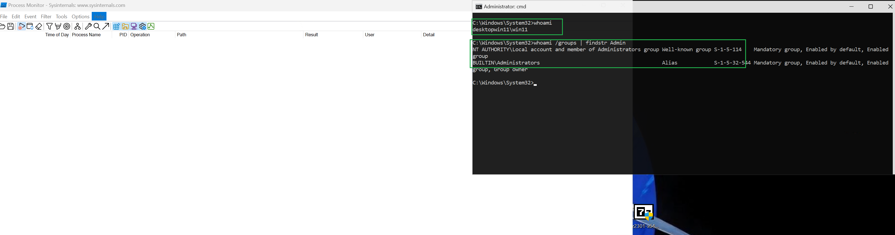
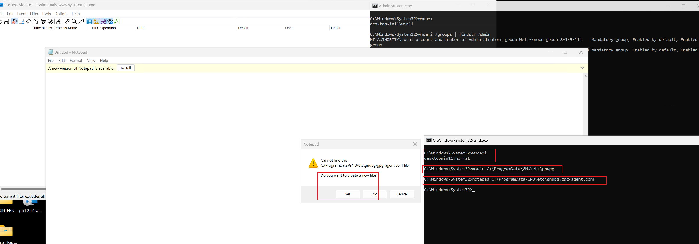
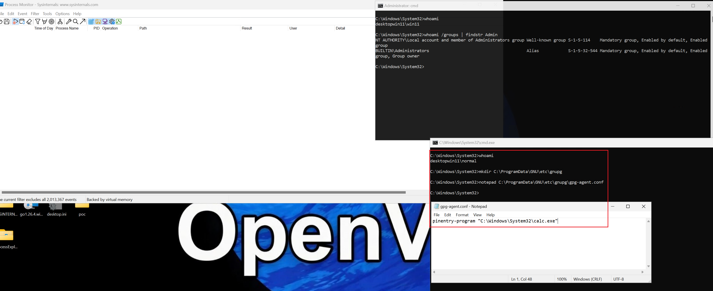
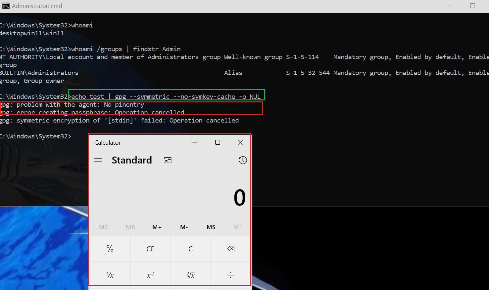
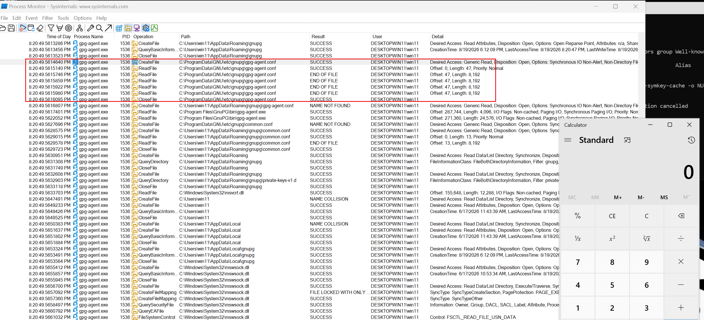
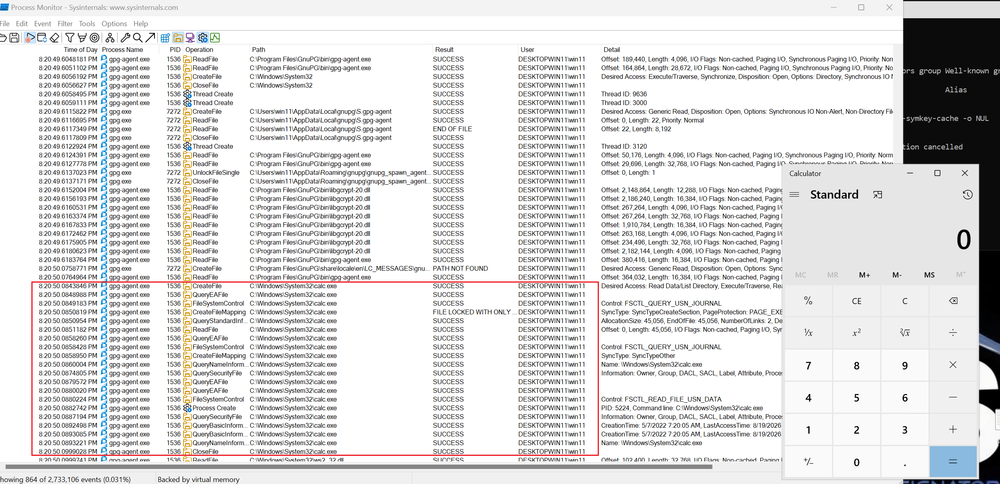

# GnuPG sysconf dir hijack via ProgramData (Local Privilege Escalation)


## Details

GnuPG 2.5.21 uses `C:\ProgramData\GNU\etc\gnupg\` as its system-wide configuration directory (`sysconfdir`). This directory does not exist by default after installation. Due to default Windows ProgramData DACL inheritance, `BUILTIN\Users` can create arbitrary subdirectories and files under `C:\ProgramData`.

## Attack Scenario

1. Low-privilege user creates `C:\ProgramData\GNU\etc\gnupg\`
2. Attacker plants `gpg-agent.conf` containing: `pinentry-program C:\attacker\path\malicious.exe`
3. When **any** user on the system runs GPG and a passphrase prompt is triggered, `gpg-agent` launches the attacker-specified executable
4. Code executes in the context of the victim user

## Proof of Concept

While operating as a regular user named `normal`:

1. Create directory structure `C:\ProgramData\GNU\etc\gnupg`

2. Create `C:\ProgramData\GNU\etc\gnupg\gpg-agent.conf`:
   ```
   pinentry-program "C:\Windows\System32\calc.exe"
   ```

3. Once any user runs a command involving asking for password, such as:
   ```
   echo test | gpg --symmetric --no-symkey-cache -o NUL
   ```
   A new process is created from the executable pointed to by the `pinentry-program` path (attacker-controlled). In the PoC, an instance of `calc.exe` was invoked on behalf of the administrative user `win11`, whereas the path was entirely controlled by the regular user `normal`, after the config file and directory structure in `ProgramData` was created and planted.

Demonstrated in screenshots `poc1-6.png`:













## Affected Config Files

All paths reported as **PATH NOT FOUND** from `sysconfdir`:

| File | Impact |
|------|--------|
| `gpg-agent.conf` | `pinentry-program` **(CODE EXECUTION)**, `scdaemon-program`, `tpm2daemon-program` |
| `gpg.conf` | System-wide GPG configuration |
| `common.conf` | Shared configuration across all GnuPG components |
| `dirmngr.conf` | Network proxy settings |
| `gpgsm.conf` | S/MIME configuration |
| `keyboxd.conf` | Keybox daemon configuration |
| `gcrypt/fips_enabled`, `gcrypt/hwf.deny`, `gcrypt/random.conf` | Crypto library configuration |

## Parent Directory DACL

```
C:\ProgramData          BUILTIN\Users:(CI)(WD,AD,WEA,WA)       — allows directory/file creation
C:\ProgramData\GNU      BUILTIN\Users:(I)(CI)(WD,AD,WEA,WA)    — inherited
```

## Impact

**HIGH** — Local privilege escalation. A low-privilege user can achieve code execution as any other user (including administrators) who uses GnuPG on the same system. Additional impact includes direct credential theft via a malicious (keylogging) `pinentry-program`.

## CVSS

**CVSS 3.1 Base Score: 7.3 (High)**  
Vector: `CVSS:3.1/AV:L/AC:L/PR:L/UI:R/S:U/C:H/I:H/A:H`

| Metric | Value | Rationale |
|--------|-------|-----------|
| Attack Complexity | Low | Requires only directory/file creation at `C:\ProgramData`, granted by default to Users |
| Privileges Required | Low | Any standard user account |
| User Interaction | Required | Another user or automated process must run a GnuPG command requiring a passphrase |

# Timeline

19.08.2026 - Report sent to security@gnupg.org

21.08.2026 - Commit https://github.com/gpg/gnupg/commit/56eb3148c7b88eb1c0804141b58cb54b9007f48d made

22.09.2026 - Article https://atos.net/wp-content/uploads/2026/09/Cybershield-hijacks-article.pdf published