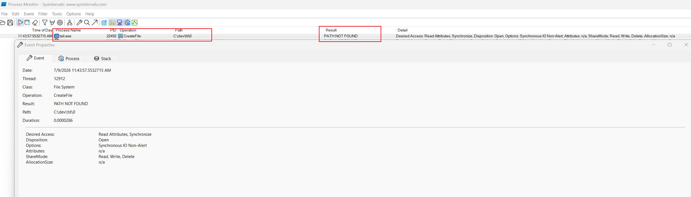
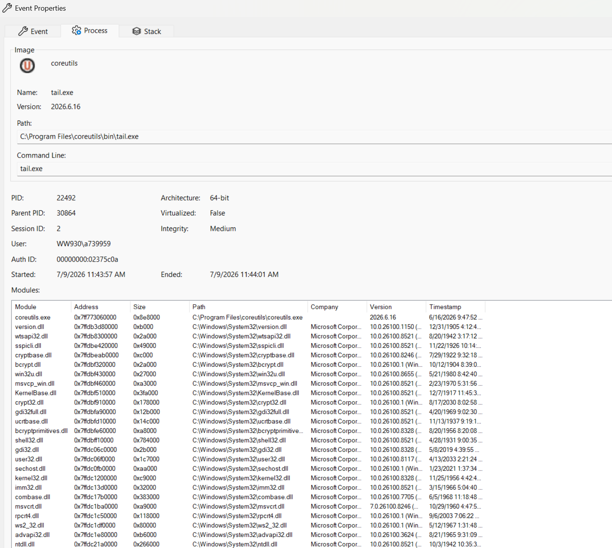
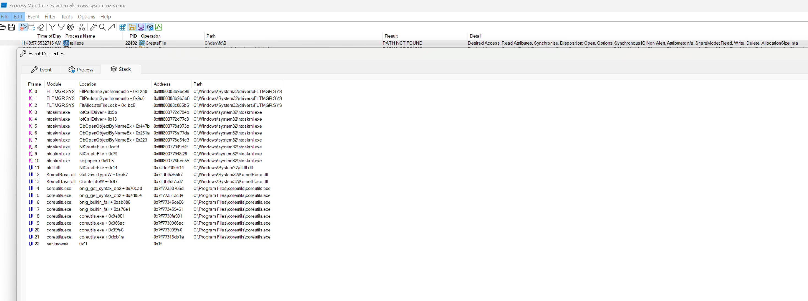
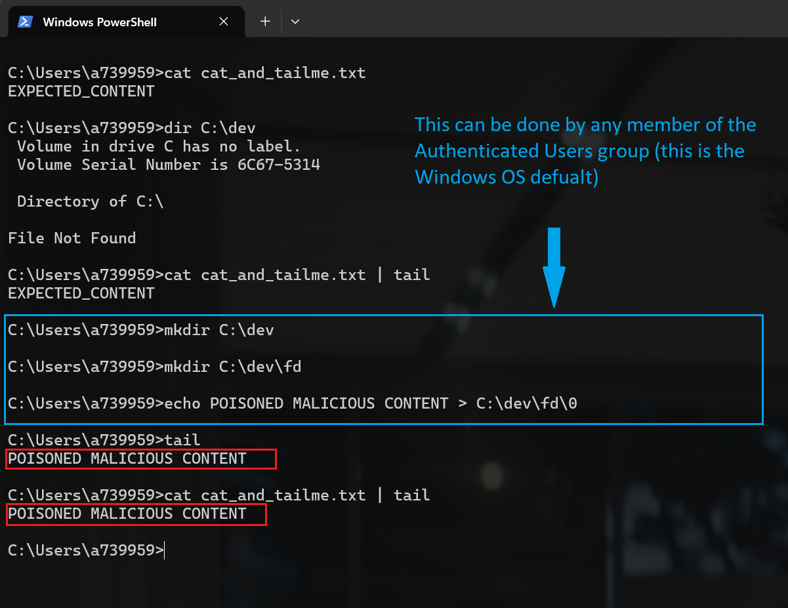
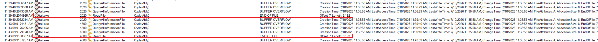
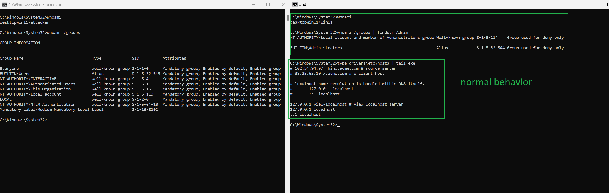
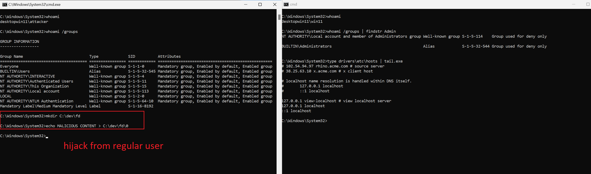
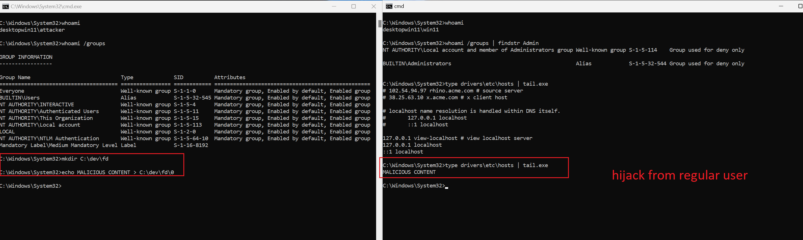

# Full Input/Output Hijacking in tail.exe (Microsoft Core Utils)

**Brief Description**: Authenticated Users Can Fully Control the Output of `tail.exe` (Local Denial of Service, with Chained Privilege-Escalation Potential)

**Affected Component:** `tail.exe` (`Microsoft Core Utils`), version `2026.6.16.0 (SHA256: C7E39F058B52E67152B93A7DA8C8F8CFC48ADF81019DDEC07B5AB3FB7A1C332A)`

---

## 1. Summary
The `tail.exe` utility can have its **standard output fully controlled by any member of the local `Authenticated Users` group**. Because `tail.exe` is a transparent conduit — it selects lines/bytes from its input and emits them verbatim — full control of its output means an unprivileged local user can force the command to emit arbitrary bytes, withhold legitimate data, or produce unbounded output, in security contexts other than their own (e.g., another user, a service, or a SYSTEM Scheduled Task that invokes `tail.exe`).

The **confirmed, deterministic impact is a local Denial of Service** and in many cases **Execution Flow Steering** (due to full integrity compromise of the data feed) against any other-context consumer of `tail.exe`.

Where the consuming context passes that output into an injection-prone sink, the same output-control primitive can be **chained into cross-user privilege escalation up to arbitrary code execution as SYSTEM** (worst-case scenario).

## 2. Severity

**Confirmed impact — Local Denial of Service / output-integrity compromise:**
- **Rating:** Medium
- **CVSS v3.1 Base Score:** 6.1
- **Vector:** `CVSS:3.1/AV:L/AC:L/PR:L/UI:N/S:U/C:N/I:L/A:H`

**Chained worst case — Local Privilege Escalation to SYSTEM (context-dependent, see §4.2):**
- **Rating:** High
- **CVSS v3.1 Base Score:** 7.8
- **Vector:** `CVSS:3.1/AV:L/AC:L/PR:L/UI:N/S:U/C:H/I:H/A:H`

Rationale: local vector, low attack complexity, low privileges required (any authenticated user), no user interaction. Availability impact and data-feed integrity loss against a cross-context consumer are guaranteed; confidentiality/integrity escalation depends on how the consuming context handles the attacker-controlled output.

## 3. Prerequisites
- Attacker holds any account in the local **Authenticated Users** group (no administrative rights).
- A separate security context (another user, a service, or a SYSTEM Scheduled Task) invokes `tail.exe` and consumes its output.

## 4. Impact

### 4.1 Confirmed (100% reproducible) — Denial of Service and output-integrity compromise
As demonstrated in the basic PoC, this is reproducible on every invocation, deterministically. 

Any script relying on the output from the tail.exe command is directly impacted. 

This alone establishes a reliable local Denial of Service and integrity compromise of any consumer of `tail.exe`. 

Depending on how the consumer processes output from tail, this behavior could be exploited to steer the consumer's execution flow.

If security decisions are made based on tail.exe's output, the impact extends beyond DoS accordingly.

Full control of `tail.exe`'s output allows an unprivileged user to, at will:
- **Withhold or truncate** legitimate data so the consuming context receives incomplete or empty output (denial of the monitored data feed).
- **Spoof / corrupt** the output so the consumer acts on attacker-chosen data (integrity loss of the feed).
- **Emit unbounded output**, causing resource exhaustion (disk/log growth, CPU, memory) in the consuming context.
- **Emit control/escape bytes** that disrupt an interactive consumer's terminal session.

The consuming context is denied correct service regardless of how carefully it is written; this impact is unconditional.

### 4.2 Potential (chained) — Cross-user privilege escalation
Because the attacker controls the exact bytes a privileged context receives, any consumer that feeds that output into an injection-prone sink can be driven beyond DoS.

Such scenarios include:
    - Visual deception / screen manipulation,
    - Window title manipulation,
    - Argument injection (if any part of tail.exe output is used by the consumer as an argument to other tools),
    - Code execution -> privilege escalation if the output is used for any code generation.

## 5. Root Cause and Basic Proof of Concept

The root cause is tail's attempt to use a nonexistent C:\dev\fd\0 file (Windows translation of the native /dev/fd/0 standard input pseudodevice) and, in the case of its existence, its preference over the real standard input.

The screenshots below demonstrate evidence from Process Monitor.

Here is what happens by defualt, when the file does not exist (the tool works properly and the nonexistent file is ignored):

The screenshot below demonstrates the simplest PoC, bringing the file to existence with arbitrary content:

Procmon evidence:

This can be achieved by any member of the Authenticated Users group, as by default Windows allows all members of that group to create new directories on C:.

## 6. Update: multi-user proof of concept

Since the original poc did not clearly demonstrate **cross-user impact**, another demonstration was conducted involving two user accounts:

## 7. Recommendation

Remove the unix reference to the /dev/fd/0 (C:\dev\fd\0) entirely, as it is not relevant to Windows.

# Timeline

10.07.2026 - Reported via MSRC

25.08.2026 - Submission got closed as not meeting the servicing threshold

22.09.2026 - Article https://atos.net/wp-content/uploads/2026/09/Cybershield-hijacks-article.pdf published