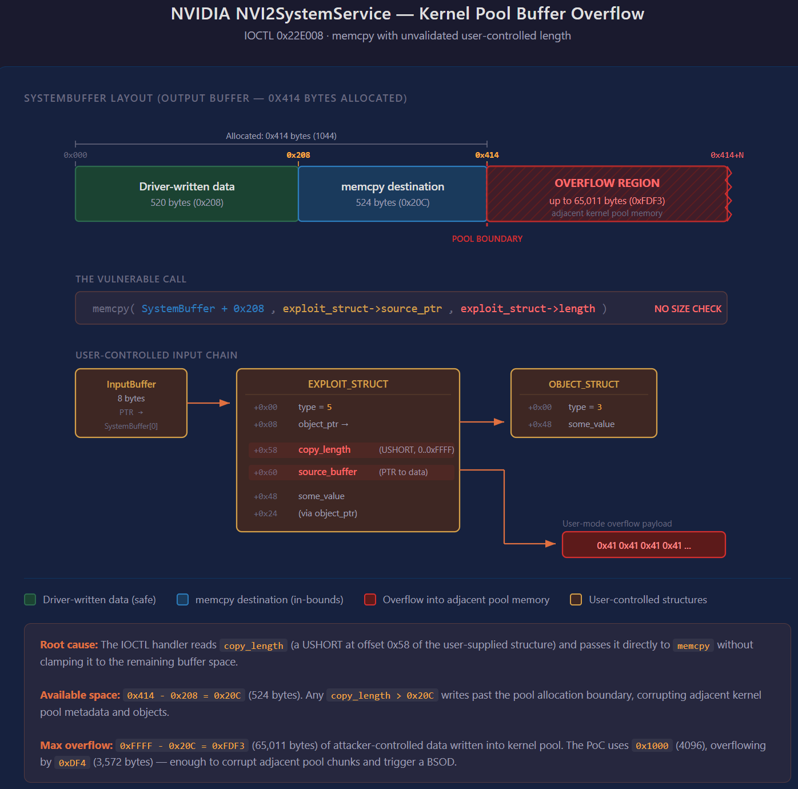
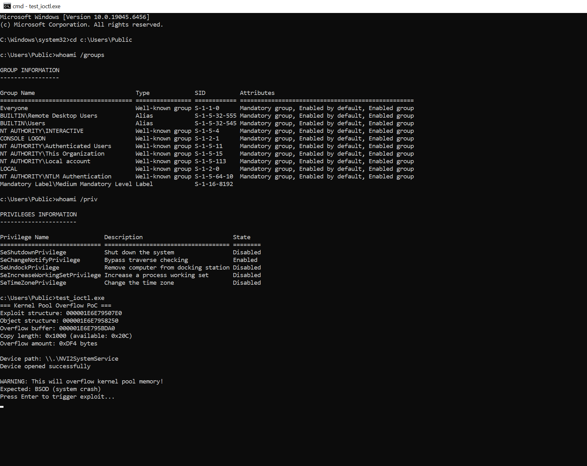
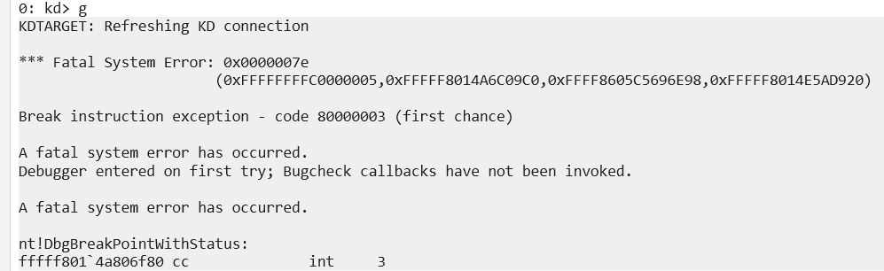
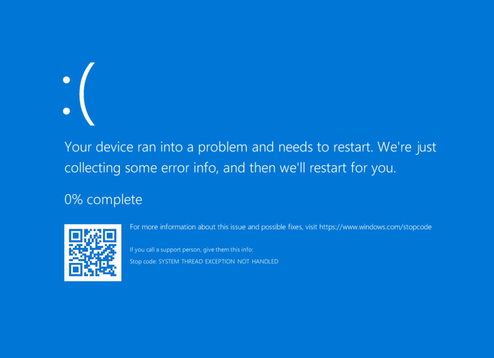

# Kernel Pool Overflow

**Product**: NVIDIA Install Helper Service (kernel mode module)

**Platform**: Windows

**Version tested**: 2.1002.147.1073

**File name**: NVI2SystemService.sys

**SHA1**: 6e9ad323d9a0646df56325b72368f5e8ecf226f2

**Issue**: Kernel Pool Overflow 

**Impact**: Denial of service, potentially local privilege escalation

## Description:

The IRP dispatch callback for NVI2SystemService device does not validate the size parameter provided in the user-supplied input buffer, then uses that size as an argument for memcpy, leading to pool overflow.

While the output buffer size is exactly 1044 bytes and the maximum size not to exceed it during memcpy operation should be 524 (the buffer is written into starting at index 520), it is possible to supply an arbitrary USHORT value (between 1 and 65535), providing plenty of space for arbitrary memory write past the allocated pool.

The issue is exploitable from a normal user account (no special privileges required).

The security descriptor of the NVI2SystemService device confirms this:

`O:BAG:SYD:(A;;0x1201bf;;;WD)(A;;FA;;;SY)(A;;FA;;;BA)(A;;0x1200a9;;;RC)S:AI(ML;;NW;;;LW)`

which includes `A;;0x1201bf;;;WD` - a quite permissive ACE for Everyone - allowing to open handles with the GENERIC_READ | GENERIC_WRITE access mask required by the 0x22e008 IOCTL (FILE_READ_WRITE_ACCESS).

## PoC

overflow_poc.c - a simple crash PoC:

## Timeline

04.12.2025 - Submission sent to psirt@nvidia.com

06.12.2025 - Response received, NVIDIA opened a ticket for the issue

06.01.2026 - Another response - the product is EOL, so it does not get CVE. But we got mentioned here https://www.nvidia.com/en-us/product-security/acknowledgements/

29.09.2026 - Full disclosure