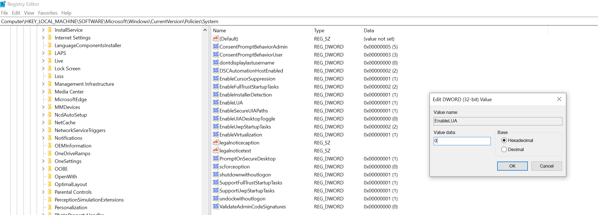
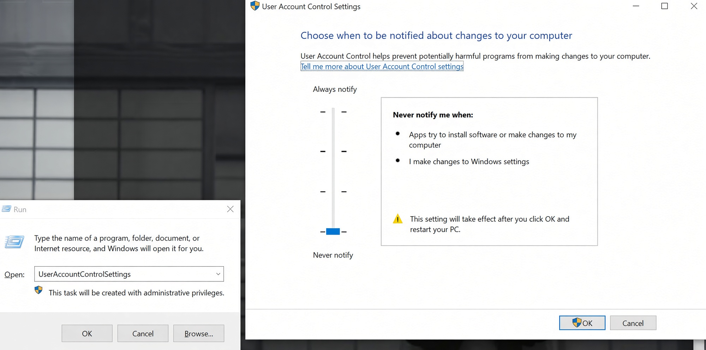
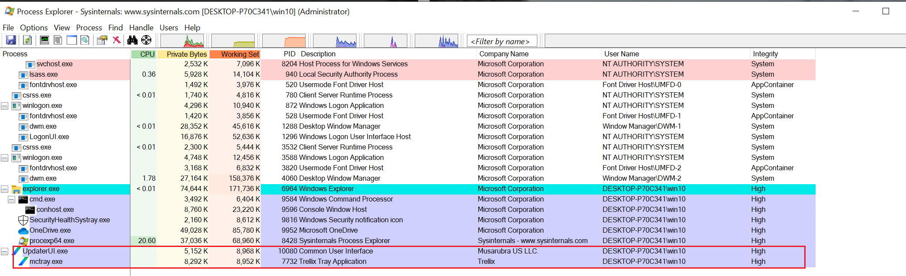
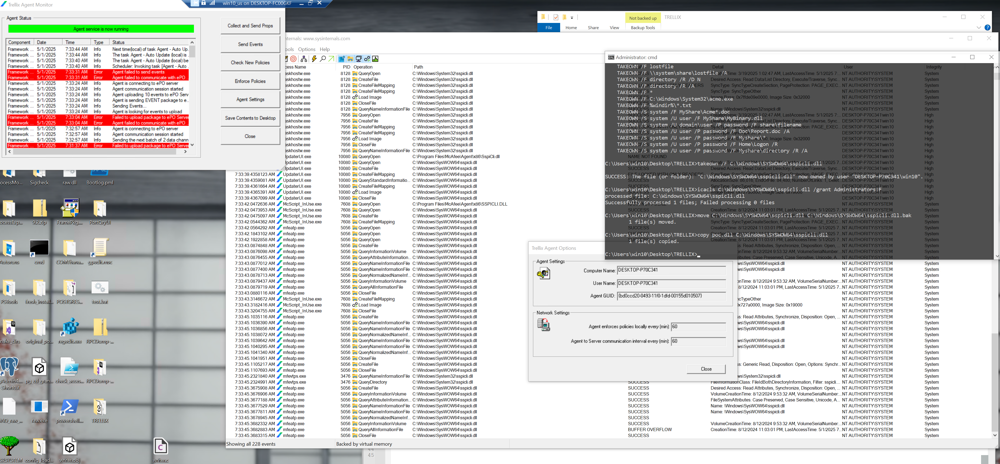
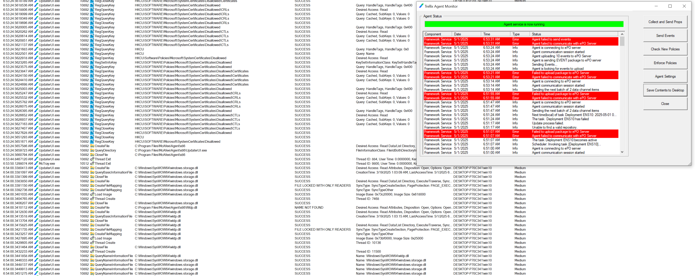

# Trellix Endpoint Protection Self-protection Bypass 

**Tested on:** Treellix Endpoint Protection version 10.7

**Related vulnerabilities**: CVE-2019-3613, CVE-2022-3859 (same product, same CVSS, same reporter)

## Overview

Trellix Endpoint Protection has a kernel-mode anti-tampering mechanism that normally prevents users with administrative privileges (Administrators or SYSTEM) from tampering with the product. That includes blocking any changes into the protected locations such as `C:\ProgramData\McAfee\Agent`, `C:\Program Files\McAfee` or `C:\Program Files (x86)\McAfee`.

A user with administrative privileges can bypass this mechanism via DLL hijacking into UpdaterUI, one of the product components - the same mechanism as CVE-2019-3613 and CVE-2022-3859.

## Details

`UpdaterUI.exe` is the GUI application accessible from the system tray in an interactive desktop session. As it turned out, the process created from this executable is whitelisted in the self-protection mechanism, which means that write operations on protected product locations are not blocked, if they originate from this process.

This process is started automatically with an interactive desktop session, running on behalf of the interactive user, with Medium integrity.

In the tested version, `UpdaterUI.exe` was still susceptible to being tricked into loading arbitrary/unsigned DLLs from global system locations such as `C:\Windows\SysWOW64` (in this particular case I temporarily replaced the legitimate `C:\Windows\SysWOW64\sspicli.dll`).

Injecting into `UpdaterUI.exe` allows to execute arbitrary code within a process that is whitelisted by the self-protection mechanism.

To make write operations from `UpdaterUI.ex` into `C:\Program Files\*` possible on the level of Windows access control, the integrity of the process had to be changed from Medium to High.

I achieved that by globally disabling UAC and the split token feature.

In such configuration - as long as my user belongs to the local Administrators group -  `UpdaterUI.exe` and `mctray.exe` both start with elevated tokens (High integrity and administrative privileges).

That, combined with the ability to inject an arbitrary DLL into that process creates a working self-protection bypass.

Keep in mind this is not a local privilege escalation issue and just like in CVE-2019-3613 and CVE-2022-3859, the prerequisite is that the user we are operating from belongs to the local Administrators group or has some other way to execute code with administrative/SYSTEM privileges.

## Steps to reproduce (high level)

1. Disable UAC globally, reboot.

2. Replace `C:\Windows\SysWOW64\sspicli.dll` with own code.

3. In `UpdaterUI.exe` -> Trellix Agent Monitor, invoke "Agent Settings", which will trigger `UpdaterUI.exe` to load `C:\Windows\SysWOW64\sspicli.dll`.


## Steps to reproduce (details)

1. Disable UAC. This should work by simply changing the value of the `HKEY_LOCAL_MACHINE\SOFTWARE\Microsoft\Windows\CurrentVersion\Policies\System\EnableLUA` registry entry from `1` to `0`:

   

   To be extra sure you also might want to disable it by invoking the User Account Control Settings panel by running `UserAccountControlSettings` and setting the slider to "Never notify":

   

2. After reboot ensure that your processes are running with elevated tokens. That should apply both to manually invoked `cmd.exe` as well as automatically started `UpdaterUI.exe`, just as presented on the screenshot:

   

3. Prepare a test DLL and make sure it has its logic in the `DllMain` function. Also make sure it properly executes on the system (e.g. has all dependencies) and that it is compiled for x86, because the target process `UpdaterUI.exe` is 32-bit. I used my standard test DLL (attached source code: `raw.cpp` + `dll.h`). I compile it with the command line Visual Studio C/C++ compiler `cl.exe` (the exact commands how to initialize the environment and use the compiler on the source file can be found in the first two lines of the source code, in comments).

   The DLL, once loaded into a process, attempts to create a new file in `C:\ProgramData\McAfee\Agent\self-protect-bypass.txt` (which is normally prevented by self-protection). Upon success it grabs the command line of the current process (the one it is injected into) and the current username and appends that information into the text file. This is to make it easier to confirm which process loaded the DLL and executed the code.

4. Replace the legitimate `C:\Windows\SysWOW64\sspicli.dll` with compiled `raw.cpp` DLL.

   It's best to do it temporarily, to minimize impact on other programs which happen to use that DLL as well.

   By default administrators do not have permissions to change or move that file, so first the default ACL needs to be changed. For instance by first taking ownership of the file (Administrators have `WriteDACL` on objects even when the permission is not explicitly granted via ACE), then grant full control to the Administrators group, then replace the file.

   Just the way it is depicted below:

   ```batch
   takeown /F C:\Windows\SysWOW64\sspicli.dll
   icacls C:\Windows\SysWOW64\sspicli.dll /grant Administrators:F
   move C:\Windows\SysWOW64\sspicli.dll C:\Windows\SysWOW64\sspicli.dll.bak
   copy poc.dll C:\Windows\SysWOW64\sspicli.dll
   ```

   

5. Invoke `UpdaterUI.exe` -> Trellix Agent Monitor -> "Agent Settings", or wait until `UpdaterUI.exe` (or some other process whitelisted in anti-tampering) loads the DLL.

6. Confirm that `C:\ProgramData\McAfee\Agent\self-protect-bypass.txt` got created, proving self protection bypass, and inspect the contents to see which process loaded the DLL.

7. Restore the original file (optional, just recommended to minimize impact on the system).

## Recommendation and additional comments

I noticed that `sspicli.dll` is not the only DLL `UpdaterUI.exe` attempts to load from `C:\Windows\SysWOW64\`, as depicted below. Therefore I am assuming those DLLs could also be used as injection vectors.



Additionally, as depicted in the PoC screenshot above, `McScript_InUse.exe` also does load the `C:\Windows\SysWOW64\sspicli.dll` (while other product processes reject it due to its invalid signature), although it seems not to be whitelisted in anti-tampering, since it did not append the .txt file despite loading the DLL. Still, being able to inject into it might be a step towards bypassing anti-tampering as well, since it is a part of the product.

Also, keep in mind that even digital signature verification prior to DLL loading, if not implemented in an atomic way, can be bypassed by winning the TOCTOU race condition (the bait and switch technique using opportunistic locks, popularized by James Forshaw).

My general recommendation is to avoid direct loading of any DLLs from global system directories and instead only rely on copies from already protected product directories such as `C:\Program Files\McAfee`.


## Timeline

01.05.2025 - Issue reported

04.10.2025 - Sent request for update due to lack of communication

05.12.2025 - Email sent to a sales representative

08.12.2025 - Email sent to Trellix Thrive requesting support or contact

09.02.2026 - Support request raised through service managment

09.10.2026 - Full disclosure
