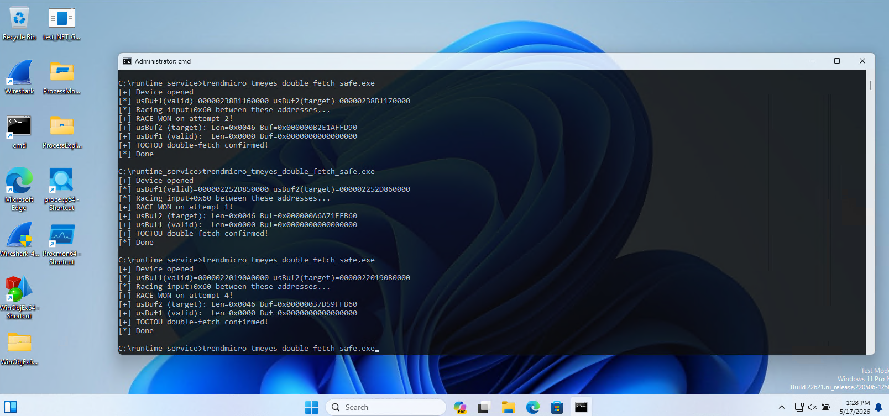

**Issue**: Double-fetch TOCTOU in IoControlCreateFile leads to arbitrary kernel write

**Privileges requierd** admin or SYSTEM (violates admin to kernel security boundary)

**Severity**: high

**Affected product**: Trend Micro Inc. TrendMicro Eyes driver Module 8.55.0.1429

**File name**: TmEyes.sys

**SHA1 sum**: 2eb5f60e2e6b819d18f34ab06db5006561f374aa

## Details

A double-fetch (TOCTOU) vulnerability exists in the IoControlCreateFile handler (IOCTL 0x9000402b, sub-command 0x2713) that allows an attacker with SYSTEM or Administrator access to write controlled data to arbitrary kernel memory addresses.

The vulnerability arises from the METHOD_NEITHER IOCTL handling pattern where nested pointers in user-mode buffers are probed by a pre-validation function (the function at RVA 0x26940) but then RE-READ from user memory by the handler (the function at RVA 0x4710c). Between these two reads, a concurrent thread can modify the pointer values.

Specifically, the pre-validator the function at RVA 0x26940 reads and probes several nested pointers from the user buffers:
- *(ulonglong *)(input + 0x60) — probed with ProbeForWrite(ptr, 0x10) 
- *(ulonglong *)(output + 0x50) — probed with ProbeForWrite(ptr, 0x30)
- *(ulonglong *)(input + 0x10) — probed with ProbeForRead(ptr, size)
- *(ulonglong *)(output + 0x58) — probed with ProbeForWrite(ptr, 0x10)

After the pre-validator succeeds, the handler function at RVA 0x4710c re-reads these same values from the mutable user-mode buffers. Crucially, the function at RVA 0x4710c reads input + 0x60 and WRITES to it.

If the attacker races to replace the value at input+0x60 from a valid user-mode address to a kernel address between the pre-validator's probe and the handler's read, the handler writes attacker-controlled data to the attacker-chosen kernel address.

The same pattern applies to output+0x50 where an OBJECT_ATTRIBUTES structure is written, and *(output+0x58).

## Impact

Arbitrary kernel write primitive. The attacker controls both the target address and 12 bytes of written data (2+2+8 bytes). This can be leveraged for full kernel code execution by overwriting critical kernel structures (token, page table entries, dispatch routines, etc.).

The device SDDL is D:P(A;;GA;;;SY)(A;;GA;;;BA), requiring SYSTEM or Administrator access. This constitutes an admin-to-kernel privilege escalation, which is security-relevant for tampering with EDR solutions (BYOVD-style attacks).


## PoC

There are two variants of the PoC:

1. double_fetch_toctou_safe_poc.c - races with another user-mode address as the target, demonstrating the condition in a safe way (no impact on the system):



2. double_fetch_crash.c - raced with an arbitrary (hardcoded) kernel target address, causing a BSOD:

```
STACK_TEXT:
ffffee00`bcb94968 fffff806`0e7668e2     : ffffee00`bcb94ad0 fffff806`0e51ae80 fffff806`09577180 fffff806`34600001 : nt!DbgBreakPointWithStatus
ffffee00`bcb94970 fffff806`0e765fa3     : fffff806`00000003 ffffee00`bcb94ad0 fffff806`0e630280 ffffee00`bcb95080 : nt!KiBugCheckDebugBreak+0x12
ffffee00`bcb949d0 fffff806`0e616c07     : 00000000`00000000 00000000`00000000 89000001`d0a0b121 ffff8000`00000000 : nt!KeBugCheck2+0xba3
ffffee00`bcb95140 fffff806`0e68c96f     : 00000000`000000be fffff806`34600002 89000001`d0a0b121 ffffee00`bcb953a0 : nt!KeBugCheckEx+0x107
ffffee00`bcb95180 fffff806`0e46211c     : 0009160b`0001d6d6 00000000`00000003 00000000`00000000 fffff806`34600002 : nt!MiSystemFault+0x1fd55f
ffffee00`bcb95280 fffff806`0e627929     : 00000000`00000000 00000000`00000000 00000000`00000000 00000000`00000000 : nt!MmAccessFault+0x29c
ffffee00`bcb953a0 fffff806`34647190     : ffffde05`f1772610 fffff806`3464ee73 ffffde05`00000000 00000000`00000000 : nt!KiPageFault+0x369
ffffee00`bcb95530 fffff806`346256d8     : 0000025d`56c00000 00000000`00000000 0000025d`56bf0000 00000000`00000000 : TmEyes+0x47190
ffffee00`bcb955d0 fffff806`3462645c     : 00000000`00000000 00000000`00000000 0000025d`56bf0000 ffffde05`f176ab88 : TmEyes+0x256d8
ffffee00`bcb95600 fffff806`34626deb     : 00000000`c00000bb ffffee00`bcb95700 00000000`9000402b fffff806`346263b0 : TmEyes+0x2645c
ffffee00`bcb95630 fffff806`346291f2     : 00000000`9000402b 00000000`c00000bb fffff806`346263b0 ffffde05`eb6e2570 : TmEyes+0x26deb
ffffee00`bcb95680 fffff806`0e4ebef5     : ffffde05`eb6e24a0 fffff806`00000000 00000000`00000002 00000000`00000000 : TmEyes+0x291f2
ffffee00`bcb95720 fffff806`0e940060     : ffffde05`eb6e24a0 00000000`00000002 ffffde05`f1630570 ffffde05`f1630570 : nt!IofCallDriver+0x55
ffffee00`bcb95760 fffff806`0e941a90     : ffffee00`00000000 00000000`00000070 ffffee00`bcb95b60 ffffde05`f1630570 : nt!IopSynchronousServiceTail+0x1d0
ffffee00`bcb95810 fffff806`0e941376     : ffffb08e`674cda00 de05f163`f904fff1 00000000`00000000 00000000`00000000 : nt!IopXxxControlFile+0x700
ffffee00`bcb95a00 fffff806`0e62bbe5     : 00000000`00000001 00000000`00000000 00000000`00000000 00000000`00000000 : nt!NtDeviceIoControlFile+0x56
ffffee00`bcb95a70 00007ffe`59ccf454     : 00007ffe`571f664b 00000000`00000000 00000000`00000000 00007ff7`82f622b8 : nt!KiSystemServiceCopyEnd+0x25
000000b3`bf2ff5c8 00007ffe`571f664b     : 00000000`00000000 00000000`00000000 00007ff7`82f622b8 00007ff7`82f622b8 : ntdll!NtDeviceIoControlFile+0x14
000000b3`bf2ff5d0 00007ffe`57c827f1     : 00000000`9000402b 00000000`00000024 00007ff7`82f62160 000000b3`bf2ff698 : KERNELBASE!DeviceIoControl+0x6b
000000b3`bf2ff640 00007ff7`82f41447     : 0000025d`56bf0000 00000000`00000005 000000b3`bf2ff790 0000025d`56c00000 : KERNEL32!DeviceIoControlImplementation+0x81
000000b3`bf2ff690 0000025d`56bf0000     : 00000000`00000005 000000b3`bf2ff790 0000025d`56c00000 0000025d`56c00000 : double_fetch_crash+0x1447
000000b3`bf2ff698 00000000`00000005     : 000000b3`bf2ff790 0000025d`56c00000 0000025d`56c00000 00000000`00000070 : 0x0000025d`56bf0000
000000b3`bf2ff6a0 000000b3`bf2ff790     : 0000025d`56c00000 0000025d`56c00000 00000000`00000070 000000b3`bf2ff7e8 : 0x5
000000b3`bf2ff6a8 0000025d`56c00000     : 0000025d`56c00000 00000000`00000070 000000b3`bf2ff7e8 00000000`00000000 : 0x000000b3`bf2ff790
000000b3`bf2ff6b0 0000025d`56c00000     : 00000000`00000070 000000b3`bf2ff7e8 00000000`00000000 0000025d`00000000 : 0x0000025d`56c00000
000000b3`bf2ff6b8 00000000`00000070     : 000000b3`bf2ff7e8 00000000`00000000 0000025d`00000000 00000000`00000000 : 0x0000025d`56c00000
000000b3`bf2ff6c0 000000b3`bf2ff7e8     : 00000000`00000000 0000025d`00000000 00000000`00000000 0000025d`00000000 : 0x70
000000b3`bf2ff6c8 00000000`00000000     : 0000025d`00000000 00000000`00000000 0000025d`00000000 0000025d`56990000 : 0x000000b3`bf2ff7e8
```


## Timeline

17.05.2026 - Report sent to security@trendmicro.com

06.08.2026 - The vendor acknowledges the issue

24.09.2026 - Another email exchange, the vendor confirms that the TmEyes driver new release is published now

06.10.2026 - Full disclosure
