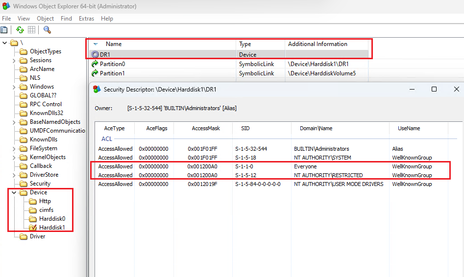
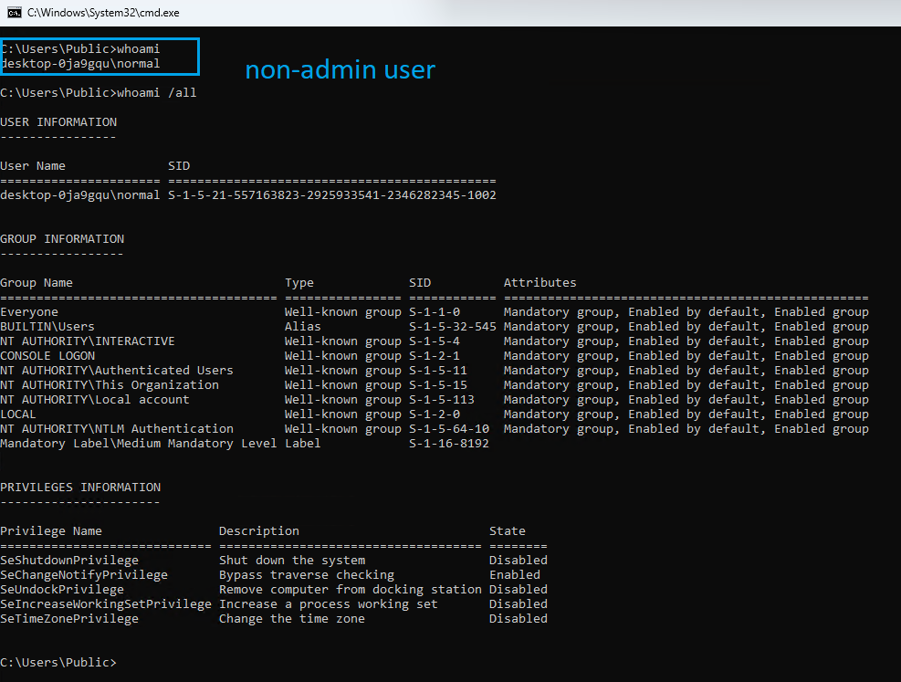
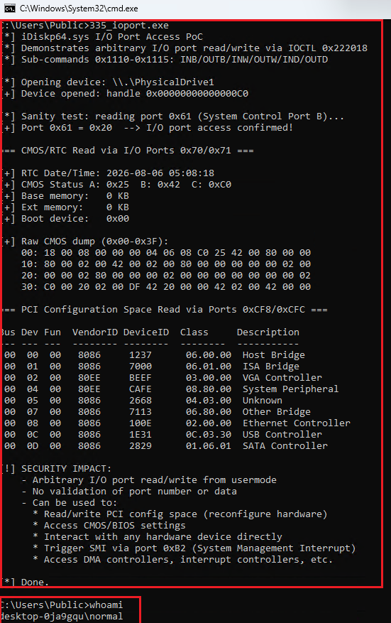

# Vulnerability Report: iDiskp64.sys — Arbitrary I/O Port Access and Disk Read/Write via Unvalidated IOCTL Handler

**Report Date:** 2026-02-27  

**Severity:** High (CVSS 3.1 Base Score: AV:L/AC:L/PR:L/UI:N/S:U/C:H/I:H/A:H | **7.8**)

**SHA1:** ff3e04a394cca8da5509afc9d483684e5bcbbeef

**Driver file:**  iDiskp64.sys

**Version:** 1.0.0.4

---

## 1. Executive Summary

A signed Windows kernel-mode disk filter driver (`iDiskp64.sys`) from the "SysBRManagment" project by Cooltion contains multiple unvalidated IOCTL sub-command handlers that expose dangerous hardware-level primitives to usermode, including **arbitrary I/O port read/write** and **arbitrary raw disk sector read/write**. 
These capabilities enable full system compromise. 

**The driver's vulnerable functionality is gated behind an activation mechanism that requires the presence of a specially crafted disk partition containing magic byte sequences. On systems with disks that have those magic byte sequences, these capabilities are already activated and IOCTLs can be reached by any local user. An administrative user, on the other hand, can satisfy the special feature activation gate by creating and attaching a specifically crafted virtual disk file (as demonstrated in the poc).** 
This makes the driver a Local Privilege Escalation vector on the systems with disks satisfying the activation gate, while also a viable candidate for **Bring-Your-Own-Vulnerable-Driver (BYOVD)** attacks.

---

## 2. Affected Component

| Field | Value |
|-------|-------|
| **Driver type** | WDM kernel-mode PnP upper filter driver (DiskDrive class) |
| **Internal project** | `E:\Project\Cooltion\SysBRManagment\Code\Driver\iDiskp\iDiskp\iDiskp.c` |
| **Architecture** | x86-64 (AMD64) |
| **Load group** | Filter (Boot-start, SERVICE_BOOT_START) |
| **Tested on** | Windows 10, Windows 11 |

---

## 3. Vulnerability Details

### 3.1 Access

The driver registers as a PnP upper filter for the `DiskDrive` device class. Its `IRP_MJ_DEVICE_CONTROL` handler (`IrpDeviceControl_Handler` at RVA `0x35D0`) processes custom IOCTL code **0x222018** (METHOD_BUFFERED, FILE_ANY_ACCESS, FILE_DEVICE_UNKNOWN).

IOCTL `0x222018` dispatches to a sub-command handler (RVA `0x6000`) that implements over 20 sub-commands indexed by the first DWORD of the input buffer. Multiple sub-commands expose dangerous kernel and hardware primitives with **zero validation** of user-supplied parameters.

### 3.2 IOCTL Characteristics

```
IOCTL Code:     0x00222018
Device Type:    0x22 (FILE_DEVICE_UNKNOWN)
Function Code:  0x806
Method:         METHOD_BUFFERED (0)
Access:         FILE_ANY_ACCESS (0)
```

The IOCTL is sent to `\\.\PhysicalDriveN` where N is the disk number hosting the activated filter device.

FILE_ANY_ACCESS in IOCTL in conjunction with the default Windows DACL (see below) effectively make it possible for any user to open a handle to \\.\PhysicalDeviceN (with desiredAccess=SYNCHRONIZE) and successflly send the IOCTL.








### 3.3 Activation Gate

Before processing IOCTL `0x222018`, the handler checks a global flag array (`DAT_140014d10[disk_number]`). This byte is set to `1` during driver initialization (`InitializeDiskDevice` at RVA `0x7690`) when a disk contains:

1. A GPT partition with type GUID `{CA47A553-9A7A-43E1-A12B-CBB2B352E928}`
2. The ASCII bytes `dom` (0x6D6F64) at the start of that partition (LBA offset from GPT entry)
3. The ASCII bytes `JKMS` (0x534D4B4A) at partition start + 11 sectors
4. A feature flag byte at the JKMS offset + 9 bytes

If none of the currently attached disks meet these conditions (which is the default, for most disks values at those LBA offsets are all 00s), this gate is **trivially bypassed** by mounting a crafted VHD file (see Section 6) - although this step requires administrative privileges.

---

## 4. Vulnerable Sub-Commands

### 4.1 Arbitrary I/O Port Access (Sub-commands 0x1110–0x1115)

| Sub-command | Operation | Description |
|-------------|-----------|-------------|
| **0x1110** | `__inbyte(port)` | Read byte from arbitrary I/O port |
| **0x1111** | `__outbyte(port, val)` | Write byte to arbitrary I/O port |
| **0x1112** | `__inword(port)` | Read word (16-bit) from arbitrary I/O port |
| **0x1113** | `__outword(port, val)` | Write word to arbitrary I/O port |
| **0x1114** | `__indword(port)` | Read dword (32-bit) from arbitrary I/O port |
| **0x1115** | `__outdword(port, val)` | Write dword to arbitrary I/O port |

**Buffer layout:**

```
Offset 0x00: Sub-command code (DWORD)
Offset 0x10: I/O port number (DWORD, truncated to USHORT by driver)
Offset 0x14: Data value (DWORD) — input for OUT, output for IN
```

**No validation is performed** on the port number or data value. The driver directly invokes x86 `IN`/`OUT` instructions via compiler intrinsics, giving usermode full unrestricted access to the entire I/O port address space (0x0000–0xFFFF).

**Security impact of arbitrary I/O port access:**

- **PCI Configuration Space manipulation** (ports 0xCF8/0xCFC): Read/write any PCI device's configuration registers, enabling BAR (Base Address Register) remapping to redirect MMIO regions to arbitrary physical addresses, IOMMU/VT-d disabling to re-enable unrestricted DMA, and bus master bit manipulation on any PCI device.
- **SMI triggering** (port 0xB2): Invoke System Management Interrupts to interact with SMM firmware, potentially exploiting known SMM vulnerabilities for ring -2 code execution.
- **System peripheral access**: Direct interaction with interrupt controllers (PIC/APIC), DMA controllers, keyboard controller (including A20 gate and CPU reset), and timer hardware.
- **System reset** (port 0xCF9): Hard-reset the machine as a denial-of-service.

### 4.2 Arbitrary Raw Disk Sector Read/Write (Sub-commands 0x1004/0x1005)

| Sub-command | Operation |
|-------------|-----------|
| **0x1004** | Read raw disk sectors |
| **0x1005** | Write raw disk sectors |

**Buffer layout:**

```
Offset 0x00: Sub-command code (DWORD)
Offset 0x04: Starting LBA sector (DWORD)
Offset 0x08: Sector count (DWORD)
Offset 0x200: Sector data buffer (512 * sector_count bytes)
```

These commands bypass the filesystem entirely, providing direct sector-level read/write access to any disk that has the driver's filter device activated. This enables:

- **Bootkit installation** by modifying the MBR, VBR, or boot manager sectors
- **Filesystem corruption** or covert data modification
- **Credential extraction** from raw NTFS structures (SAM, SECURITY hives)
- **Evidence tampering** on forensic targets

### 4.3 Mapped Disk I/O via Kernel Virtual Address (Sub-commands 0x1008/0x1009)

Similar to 0x1004/0x1005, but accept a kernel virtual address (sign-extended from a 32-bit input) as the target buffer, bypassing the SystemBuffer mechanism.

### 4.4 Physical Memory Mapping (Sub-command 0x1116) — Broken on x64

The driver contains a physical memory mapping function (RVA `0x57C0`) that:

1. Opens `\Device\PhysicalMemory` via `ZwOpenSection`
2. Translates addresses via `HalTranslateBusAddress` on the ISA bus
3. Maps arbitrary physical memory via `ZwMapViewOfSection` with `PAGE_READWRITE`

There is **no validation** of the physical address or size parameters. However, this sub-command is **non-functional on x64** due to a porting bug: the driver stores the `ViewSize` parameter as a 32-bit DWORD (`mov dword ptr [rsp+0E8h], eax`) while `ZwMapViewOfSection` expects a 64-bit `SIZE_T*`. The upper 32 bits of the stack location contain stale data, causing the function to consistently return `STATUS_INVALID_PARAMETER` (0xC000000D). On a hypothetical 32-bit deployment, this would work as a trivial arbitrary physical memory R/W primitive.

### 4.5 Additional Sub-Commands

| Sub-command | Description |
|-------------|-------------|
| 0x1007 | Retrieve internal metadata structure (0xD7C bytes per disk) |
| 0x1100/0x1101 | Reinitialize disk device / rescan partition table |
| 0x1117 | Unmap previously mapped physical memory section |
| 0x1118 | Partition manipulation operations |
| 0x1119–0x1121 | Various internal metadata write operations |
| 0x1200/0x1201 | Write metadata to disk (requires 0x55AA55AA magic header) |

---

## 5. BYOVD Threat Assessment

### 5.1 Bring-Your-Own-Vulnerable-Driver Applicability

This driver is a strong BYOVD candidate due to the following characteristics:

**Self-contained deployment:** An attacker with administrator privileges needs only four artifacts:
1. The signed `iDiskp64.sys` binary (~120 KB)
2. A registration script (service creation + DiskDrive UpperFilters registry entry)
3. A crafted VHD file (~64 KB) containing the activation magic bytes

Reboot is not necessary.

**Novel activation evasion:** Unlike most BYOVD drivers (e.g., RTCore64.sys, dbutil_2_3.sys, gdrv.sys) whose vulnerable IOCTLs are immediately accessible after loading, iDiskp64.sys requires a specifically crafted disk to be present. This creates a **two-stage activation model** that evades detection in several ways:

- **Static analysis evasion:** Automated driver analysis tools that send test IOCTLs will receive pass-through behavior (the driver forwards unrecognized IOCTLs to lower drivers and returns their status). The vulnerable sub-command handler is never reached without activation.
- **Behavioral detection evasion:** The VHD mount operation (`Mount-VHD`, `diskpart attach vdisk`) is a legitimate administrative action. EDR heuristics tuned for known BYOVD patterns (load driver → send IOCTL) would need to correlate driver loading with VHD attachment — a non-standard detection pattern.
- **Hash-based blocklist bypass:** Microsoft's Vulnerable Driver Blocklist and similar protections rely on known driver hashes. A previously uncatalogued driver from a niche backup/recovery product is unlikely to be listed.

**Exploitation chain to kernel code execution via I/O ports:**

```
Admin shell
  → Install iDiskp64.sys as DiskDrive UpperFilter (boot-start)
  → Reboot
  → Mount crafted VHD → driver activation flag set
  → IOCTL 0x222018, sub-command 0x1114: Read PCI config (port 0xCF8/0xCFC)
  → Enumerate PCI devices, locate target device BAR
  → IOCTL 0x222018, sub-command 0x1115: Write PCI config
  → Remap BAR to overlap kernel physical memory (or disable IOMMU)
  → Arbitrary kernel memory read/write achieved
  → Token manipulation / callback removal / code patching
```

**Alternative bootkit chain via raw disk I/O:**

```
Admin shell
  → Same setup as above
  → IOCTL 0x222018, sub-command 0x1004: Read boot sectors
  → IOCTL 0x222018, sub-command 0x1005: Write modified boot code
  → Persistence achieved below OS level
```

### 5.2 Comparison to Known BYOVD Drivers

| Driver | Vendor | Primitive | Activation Required | Detection Status |
|--------|--------|-----------|-------------------|-----------------|
| iDiskp64.sys | Cooltion | I/O port R/W, raw disk R/W | **Yes (crafted VHD)** | **Not detected** |
| RTCore64.sys | MSI | Physical memory R/W | No | Widely detected |
| dbutil_2_3.sys | Dell | Physical memory R/W | No | CVE-2021-21551, blocked |
| gdrv.sys | Gigabyte | Physical memory R/W | No | Widely detected |
| ene.sys | ENE Technology | Physical memory R/W | No | Detected by some EDR |
| HW.sys | Marvin Test | I/O port + phys mem | No | Detected by some EDR |

The activation gate is a distinguishing feature that simultaneously limits casual exploitation and enhances sophistication for targeted attacks.

---

## 6. Proof of Concept

### 6.1 VHD Activation File Generation

A Python script (`craft_idiskp64_vhd.py`) generates a 64 MB fixed-format VHD file containing:

- Protective MBR with GPT indicator (type 0xEE)
- GPT header with valid CRC32 checksums
- Partition entry with type GUID `{CA47A553-9A7A-43E1-A12B-CBB2B352E928}`
- `dom` magic (0x6D6F64) at partition start (LBA 2048)
- `JKMS` magic (0x534D4B4A) at LBA 2059 (partition start + 11 sectors)
- Feature activation flag at JKMS + 9 bytes
- Standard VHD footer

Mounting this VHD with `Mount-VHD` or `diskpart` triggers the driver's `InitializeDiskDevice` function, which reads the magic bytes and sets `DAT_140014d10[disk_number] = 1`, enabling all vulnerable sub-commands for that disk device.

### 6.2 I/O Port Access PoC

A C program (`335_ioport_poc.c`) demonstrates:

1. **CMOS/RTC read** — Reads system date/time and BIOS configuration via ports 0x70/0x71
2. **PCI device enumeration** — Scans PCI buses 0–1 reading vendor/device IDs and class codes via ports 0xCF8/0xCFC

This confirms arbitrary I/O port access from usermode through the driver.


### 6.3 Reproduction Steps

1. Place `iDiskp64.sys` in `%SystemRoot%\System32\drivers\`
2. Register as a boot-start DiskDrive upper filter:
   ```
   sc create iDiskp64 type= kernel start= boot group= Filter binpath= System32\drivers\iDiskp64.sys
   reg add "HKLM\SYSTEM\CurrentControlSet\Control\Class\{4d36e967-e325-11ce-bfc1-08002be10318}" /v UpperFilters /t REG_MULTI_SZ /d "iDiskp64\0partmgr" /f
   ```
3. Generate and mount the activation VHD:
   ```
   python craft_idiskp64_vhd.py
   Mount-VHD -Path .\idiskp64_trigger.vhd
   ```
5. Run the PoC (as normal user):
   ```
   335_ioport.exe \\.\PhysicalDrive1
   ```
6. Expect output like below or system crash:


---

## 7. Root Cause Analysis

1. **No IOCTL input validation:** The sub-command handler directly uses user-controlled buffer values as I/O port addresses, sector numbers, and memory addresses without any bounds checking or allowlisting.

2. **Overly permissive IOCTL access control:** IOCTL 0x222018 is defined with `FILE_ANY_ACCESS`, meaning no specific access rights are checked beyond the ability to open the device. Since `\\.\PhysicalDriveN` is accessible to administrators, any admin-level process can invoke the vulnerable sub-commands.

3. **Security-sensitive kernel APIs exposed to usermode:** The driver wraps `IN`/`OUT` instructions, direct disk I/O, and `\Device\PhysicalMemory` mapping as IOCTL sub-commands, effectively providing ring-0 hardware access primitives to ring-3 callers.

4. **Security-through-obscurity activation gate:** The magic-byte activation mechanism provides no real security — the required byte patterns are embedded in the driver binary and can be reverse-engineered in minutes. A VHD containing these patterns can be generated programmatically.

---

## 8. Impact

| Category | Impact |
|----------|--------|
| **Confidentiality** | High — arbitrary I/O port and disk sector reads expose all system data |
| **Integrity** | High — arbitrary I/O port writes, disk sector writes enable full system modification |
| **Availability** | High — system reset via port 0xCF9, interrupt controller manipulation, disk corruption |
| **Scope** | Changed — hardware-level access transcends OS-level isolation boundaries; potential for firmware/SMM compromise |

**Attack scenarios enabled:**

- Kernel code execution via PCI BAR remapping or IOMMU disabling
- Bootkit/rootkit installation via raw disk sector writes
- Credential theft from raw disk reads (SAM/SECURITY hive extraction)
- BIOS/UEFI settings modification via CMOS writes
- Anti-malware/EDR disabling via kernel memory manipulation (after achieving kernel R/W through PCI reconfiguration)
- SMM-level compromise via SMI triggering (port 0xB2)

---


## Timeline

27.02.2026 - First attempt to contact the vendor

15.03.2026 - Second attempt to contact the vendor

06.08.2026 - Reported to VINCE (VRF#26-08-PRLFX)

12.08.2026 - US CERT response: "For driver vulnerabilities where vendor coordination paths are unknown, incomplete, or otherwise impractical, and the primary exploitation path is via Bring Your Own Vulnerable Driver (BYOVD) scenarios, the most appropriate solution is often adding the affected driver to the Microsoft Vulnerable Driver Blocklist."

28.09.2026 - Publication