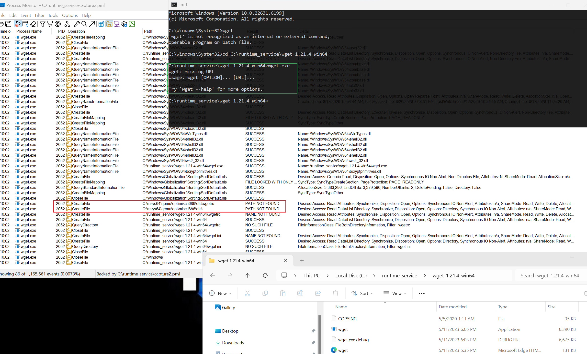
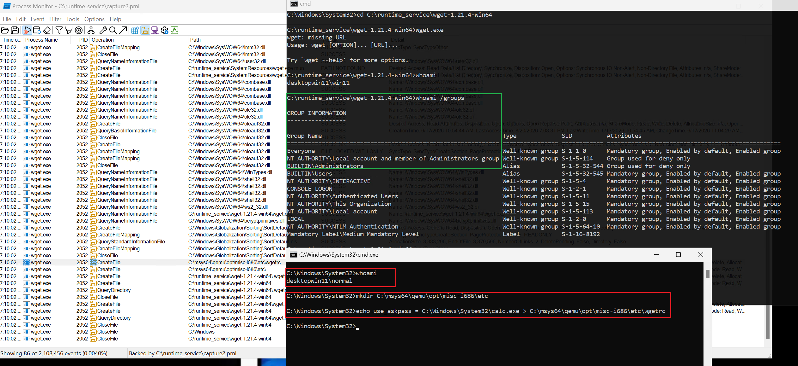
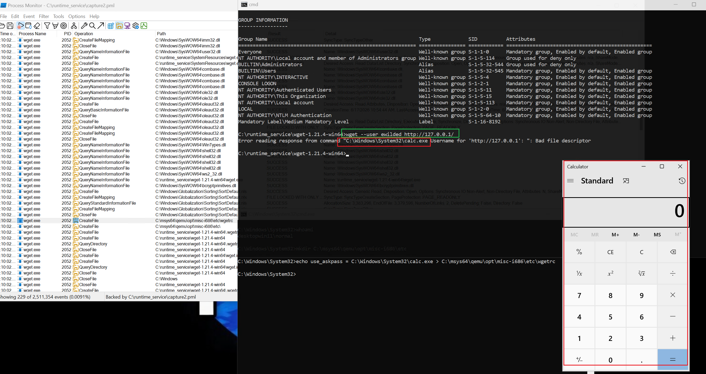
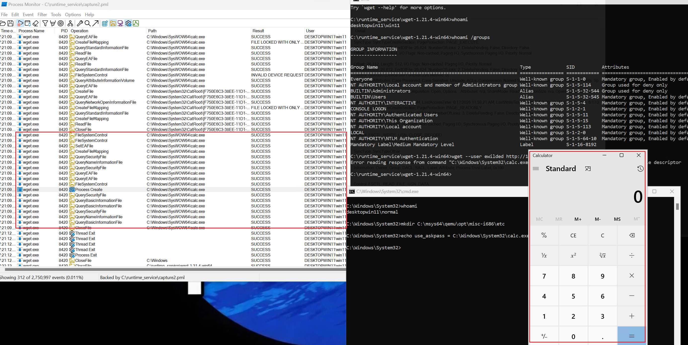
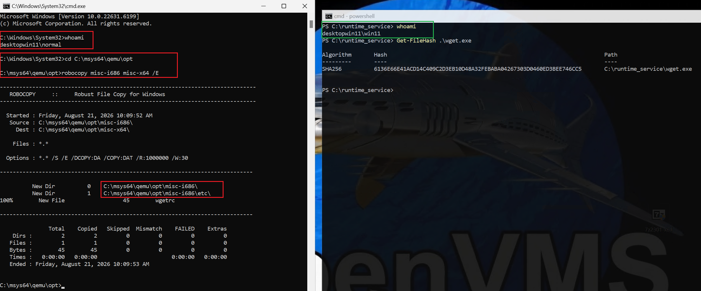
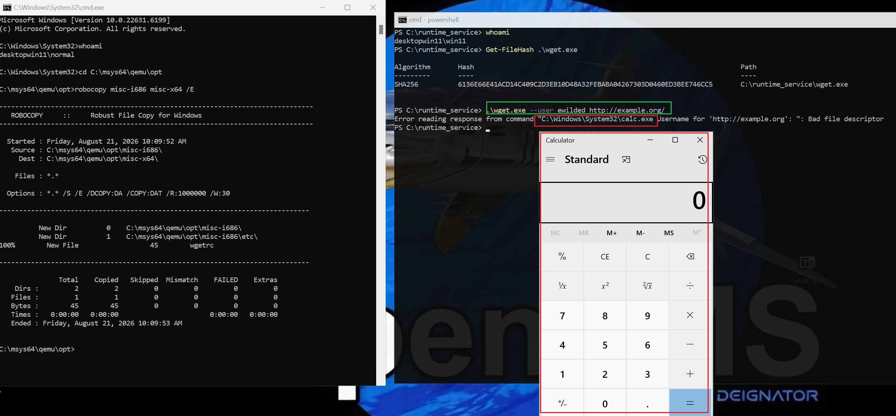
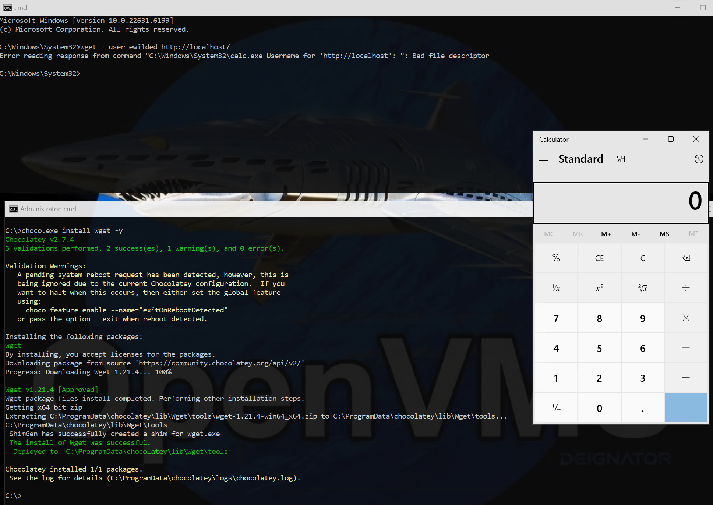

# wget Windows builds Config File Hijacking leading to Cross-User Code Execution/Local Privilege Escalation (CVE-2026-94574)

**Product:** GNU wget, latest Windows builds from https://eternallybored.org/misc/wget/

## Versions Tested

| Architecture | SHA-256 | URL |
|---|---|---|
| x64 | `6136e66e41acd14c409c2d3eb10d48a32febaba04267303d0460ed3bee746cc5` | https://eternallybored.org/misc/wget/1.21.4/64/wget.exe |
| x86 | `7c722c4a25a26f7179027b1323ed8e291c48365c6f87345e61ee8d5ebd2e5ba0` | https://eternallybored.org/misc/wget/1.21.4/32/wget.exe |

---

## Details

`wget.exe` (GNU Wget 1.21.4) has a hardcoded `SYSTEM_WGETRC` path compiled from the MSYS2/MinGW build environment. Depending on the build (x86 vs x64), it is one of:

```
C:\msys64\qemu\opt\misc-i686\etc\wgetrc   (x86)
C:\msys64\qemu\opt\misc-x64\etc\wgetrc    (x64)
```

This path is confirmed by `wget.exe --version` output:

```
Wgetrc: C:/msys64/qemu/opt/misc-i686/etc/wgetrc (system)
Wgetrc: C:/msys64/qemu/opt/misc-x64/etc/wgetrc
```

This can be confirmed with Procmon:



---

## Exploitability

The `C:\` root directory DACL grants:

- `NT AUTHORITY\Authenticated Users:(AD)` — Append Data (create subdirectories)
- `NT AUTHORITY\Authenticated Users:(OI)(CI)(IO)(M)` — Modify (inherited to new subdirectories)

Any authenticated (non-admin) user can create the full directory tree `C:\msys64\qemu\opt\misc-i686\etc\` and place a malicious `wgetrc` file there.

### `C:\` DACL

```
C:\ BUILTIN\Administrators:(OI)(CI)(F)
    NT AUTHORITY\SYSTEM:(OI)(CI)(F)
    BUILTIN\Users:(OI)(CI)(RX)
    NT AUTHORITY\Authenticated Users:(OI)(CI)(IO)(M)
    NT AUTHORITY\Authenticated Users:(AD)
    Mandatory Label\High Mandatory Level:(OI)(NP)(IO)(NW)
```

---

## Code Execution Proof

A `wgetrc` file containing the directive:

```
use_askpass = C:\path\to\malicious.exe
```

causes wget to execute the specified program whenever it needs to prompt for credentials (e.g., HTTP 401, `--user=` flag). The malicious program runs in the context of the user executing wget.

A PoC was conducted using two user accounts and `calc.exe`, for both x86 and x64 builds.

### x86 PoC Screenshots






### x64 PoC Screenshots





### Installations from chocolatey affected as well



---

## Additional Attack Vectors via `wgetrc`

| Directive | Effect |
|---|---|
| `http_proxy` / `https_proxy` | Redirect all traffic through an attacker-controlled proxy (MITM, credential theft) |
| `ca_certificate` / `ca_directory` | Override trusted CAs to enable HTTPS MITM |
| `no_check_certificate` | Disable TLS certificate verification |
| `output_document` | Overwrite arbitrary files with downloaded content |

---

## Impact

**HIGH** — A low-privileged user can plant a malicious `wgetrc` that will execute arbitrary code when any other user (including administrators or automated scripts) runs `wget.exe` with credential prompts. The proxy redirection vectors also enable credential theft and content manipulation without requiring code execution.

| Field | Value |
|---|---|
| CVSS 3.1 Base Score | **7.3 (High)** |
| Vector | `CVSS:3.1/AV:L/AC:L/PR:L/UI:R/S:U/C:H/I:H/A:H` |


# Timeline 


21.08.2026 - Reported to maintainers

03.09.2026 - The maintainer put out a warning at https://eternallybored.org/misc/wget/

04.09.2026 - Issue submitted to VINCE

11.09.2026 - CVE-2026-94574 assigned by US CERT

22.09.2026 - Article https://atos.net/wp-content/uploads/2026/09/Cybershield-hijacks-article.pdf published